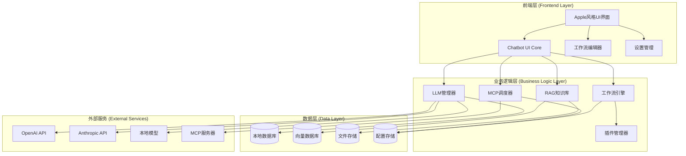

# Bor 智能体中枢 - 设计文档

## 概述

Bor 智能体中枢采用革命性的"对话即界面"设计理念，摒弃传统的菜单、按钮、侧边栏等复杂界面元素，通过纯对话交互实现所有功能控制。用户只需要通过自然语言即可完成 LLM 配置、知识库管理、工作流创建、系统设置等所有操作，打造极简而强大的智能助手体验。

系统采用现代化的 Web-First 架构，通过集成成熟的开源组件构建一个瑞士军刀式的个人智能助手平台，最终通过 Electron 等技术打包为桌面应用。

## 架构设计

### 整体架构



### 技术栈选择

#### 前端技术栈
- **框架**: Vue 3 + TypeScript + Vite
- **UI 基础**: Chatbot UI (定制化)
- **样式**: Tailwind CSS + Apple Design System
- **状态管理**: Pinia
- **路由**: Vue Router
- **桌面化**: Electron

#### 后端技术栈
- **运行时**: Node.js
- **框架**: Express.js / Fastify
- **数据库**: SQLite (本地) + Chroma (向量)
- **文件处理**: Multer + PDF.js
- **进程管理**: PM2

#### 集成组件
- **LLM 管理**: LLMChat Core
- **MCP 协议**: @modelcontextprotocol/sdk
- **工作流引擎**: 自研 + Temporal (可选)

## 组件设计

### 1. Apple 风格 UI 组件

#### 设计系统
```typescript
// src/design-system/tokens.ts
export const DesignTokens = {
  colors: {
    primary: {
      blue: '#007AFF',
      indigo: '#5856D6',
      purple: '#AF52DE',
    },
    neutral: {
      white: '#FFFFFF',
      gray100: '#F2F2F7',
      gray200: '#E5E5EA',
      gray300: '#D1D1D6',
      gray400: '#C7C7CC',
      gray500: '#AEAEB2',
      gray600: '#8E8E93',
      black: '#000000',
    },
    semantic: {
      success: '#34C759',
      warning: '#FF9500',
      error: '#FF3B30',
    }
  },
  
  spacing: {
    xs: '4px',
    sm: '8px',
    md: '16px',
    lg: '24px',
    xl: '32px',
    xxl: '48px',
  },
  
  borderRadius: {
    sm: '6px',
    md: '12px',
    lg: '16px',
    xl: '20px',
  },
  
  typography: {
    fontFamily: {
      system: '-apple-system, BlinkMacSystemFont, "SF Pro Display", sans-serif',
      mono: '"SF Mono", Monaco, "Cascadia Code", monospace',
    },
    fontSize: {
      xs: '12px',
      sm: '14px',
      base: '16px',
      lg: '18px',
      xl: '20px',
      '2xl': '24px',
      '3xl': '30px',
    }
  },
  
  effects: {
    glassmorphism: {
      background: 'rgba(255, 255, 255, 0.8)',
      backdropFilter: 'blur(20px)',
      border: '1px solid rgba(255, 255, 255, 0.2)',
    },
    shadow: {
      sm: '0 1px 3px rgba(0, 0, 0, 0.1)',
      md: '0 4px 6px rgba(0, 0, 0, 0.1)',
      lg: '0 10px 15px rgba(0, 0, 0, 0.1)',
    }
  }
}
```

#### 极简对话界面组件
```vue
<!-- src/components/ChatInterface.vue -->
<template>
  <div class="chat-interface-minimal">
    <!-- 纯净的消息列表 - 无边框、无装饰 -->
    <div class="messages-container" ref="messagesContainer">
      <ChatMessage
        v-for="message in messages"
        :key="message.id"
        :message="message"
        :is-streaming="message.id === streamingMessageId"
        :show-system-controls="message.type === 'system-config'"
      />
    </div>
    
    <!-- 极简输入区域 - 无按钮、无菜单 -->
    <div class="input-area-minimal">
      <ChatInput
        v-model="inputText"
        :is-loading="isLoading"
        :placeholder="getContextualPlaceholder()"
        @send="handleIntelligentSend"
        @file-drop="handleFileDrop"
        @voice-input="handleVoiceInput"
      />
    </div>
  </div>
</template>

<script setup lang="ts">
import { ref, computed, onMounted } from 'vue'
import { useChatStore } from '@/stores/chat'
import { useLLMStore } from '@/stores/llm'
import ChatMessage from './ChatMessage.vue'
import ChatInput from './ChatInput.vue'

const chatStore = useChatStore()
const llmStore = useLLMStore()

const inputText = ref('')
const isLoading = ref(false)
const streamingMessageId = ref<string | null>(null)

const messages = computed(() => chatStore.currentConversation?.messages || [])
const availableTools = computed(() => chatStore.availableTools)

const handleIntelligentSend = async (content: string, attachments?: File[]) => {
  if (!content.trim() && !attachments?.length) return
  
  isLoading.value = true
  
  try {
    // 添加用户消息
    const userMessage = await chatStore.addMessage({
      role: 'user',
      content,
      attachments
    })
    
    // 智能意图识别 - 通过对话控制所有功能
    const intent = await intentRecognizer.analyze(content)
    
    switch (intent.type) {
      case 'system_config':
        await handleSystemConfig(content, intent.params)
        break
      case 'llm_management':
        await handleLLMManagement(content, intent.params)
        break
      case 'knowledge_base':
        await handleKnowledgeBase(content, intent.params, attachments)
        break
      case 'workflow_creation':
        await handleWorkflowRequest(content)
        break
      case 'mcp_management':
        await handleMCPManagement(content, intent.params)
        break
      default:
        await handleChatRequest(userMessage)
    }
  } catch (error) {
    console.error('发送消息失败:', error)
  } finally {
    isLoading.value = false
    inputText.value = ''
  }
}

const isWorkflowRequest = (content: string): boolean => {
  const workflowKeywords = ['创建工作流', '自动化', '定时任务', '批处理', '脚本']
  return workflowKeywords.some(keyword => content.includes(keyword))
}

const handleWorkflowRequest = async (content: string) => {
  // 调用工作流生成服务
  const workflowService = useWorkflowService()
  const generatedWorkflow = await workflowService.generateFromDescription(content)
  
  // 显示生成的工作流供用户确认
  await chatStore.addMessage({
    role: 'assistant',
    content: `我为您生成了以下工作流，请确认是否符合您的需求：\n\n\`\`\`yaml\n${generatedWorkflow}\n\`\`\``,
    metadata: {
      type: 'workflow',
      workflow: generatedWorkflow
    }
  })
}
</script>
```

### 2. LLM 管理系统

#### LLM 管理器架构
```typescript
// src/services/llm/LLMManager.ts
import { LLMProvider, ChatRequest, ChatResponse } from './types'
import { OpenAIProvider } from './providers/OpenAIProvider'
import { AnthropicProvider } from './providers/AnthropicProvider'
import { OllamaProvider } from './providers/OllamaProvider'

export class LLMManager {
  private providers: Map<string, LLMProvider> = new Map()
  private defaultProvider: string = 'openai'
  
  constructor() {
    this.initializeProviders()
  }
  
  private initializeProviders() {
    // 注册各种 LLM 提供商
    this.providers.set('openai', new OpenAIProvider())
    this.providers.set('anthropic', new AnthropicProvider())
    this.providers.set('ollama', new OllamaProvider())
  }
  
  async chat(request: ChatRequest): Promise<ChatResponse> {
    const provider = this.selectProvider(request)
    
    // 集成 RAG 增强
    const enhancedRequest = await this.enhanceWithRAG(request)
    
    // 执行对话
    return await provider.chat(enhancedRequest)
  }
  
  private selectProvider(request: ChatRequest): LLMProvider {
    // 智能路由逻辑
    if (request.preferredModel) {
      const provider = this.providers.get(request.preferredModel)
      if (provider) return provider
    }
    
    // 根据请求类型选择最适合的模型
    if (request.requiresCodeGeneration) {
      return this.providers.get('anthropic') || this.providers.get('openai')!
    }
    
    if (request.requiresPrivacy) {
      return this.providers.get('ollama')!
    }
    
    return this.providers.get(this.defaultProvider)!
  }
  
  private async enhanceWithRAG(request: ChatRequest): Promise<ChatRequest> {
    const ragService = useRAGService()
    const relevantDocs = await ragService.search(request.content)
    
    if (relevantDocs.length > 0) {
      const context = relevantDocs.map(doc => doc.content).join('\n\n')
      request.content = `基于以下上下文信息回答问题：\n\n${context}\n\n问题：${request.content}`
    }
    
    return request
  }
}
```

#### 多供应商提供商实现
```typescript
// src/services/llm/providers/ProviderFactory.ts
import { LLMProvider } from '../types'
import { OllamaProvider } from './OllamaProvider'
import { OpenRouterProvider } from './OpenRouterProvider'
import { OpenAIProvider } from './OpenAIProvider'
import { OpenAICompatibleProvider } from './OpenAICompatibleProvider'
import { ZhipuProvider } from './ZhipuProvider'
import { GeminiProvider } from './GeminiProvider'

export class ProviderFactory {
  static createProvider(config: ProviderConfig): LLMProvider {
    switch (config.type) {
      case 'ollama':
        return new OllamaProvider(config)
      case 'openrouter':
        return new OpenRouterProvider(config)
      case 'openai':
        return new OpenAIProvider(config)
      case 'openai-compatible':
        return new OpenAICompatibleProvider(config)
      case 'zhipu':
        return new ZhipuProvider(config)
      case 'gemini':
        return new GeminiProvider(config)
      default:
        throw new Error(`不支持的供应商类型: ${config.type}`)
    }
  }
}

// src/services/llm/providers/OllamaProvider.ts
export class OllamaProvider implements LLMProvider {
  private baseURL: string
  
  constructor(config: ProviderConfig) {
    this.baseURL = config.baseURL || 'http://localhost:11434'
  }
  
  async getAvailableModels(): Promise<string[]> {
    const response = await fetch(`${this.baseURL}/api/tags`)
    const data = await response.json()
    return data.models.map((model: any) => model.name)
  }
  
  async chat(request: ChatRequest): Promise<ChatResponse> {
    const response = await fetch(`${this.baseURL}/api/chat`, {
      method: 'POST',
      headers: { 'Content-Type': 'application/json' },
      body: JSON.stringify({
        model: request.model,
        messages: request.messages,
        stream: true
      })
    })
    
    return this.handleStreamResponse(response)
  }
}

// src/services/llm/providers/OpenRouterProvider.ts
export class OpenRouterProvider implements LLMProvider {
  private client: OpenAI
  
  constructor(config: ProviderConfig) {
    this.client = new OpenAI({
      apiKey: config.apiKey,
      baseURL: 'https://openrouter.ai/api/v1',
      defaultHeaders: {
        'HTTP-Referer': 'https://bor-ai.app',
        'X-Title': 'Bor智能体中枢'
      }
    })
  }
  
  async getAvailableModels(): Promise<string[]> {
    const response = await fetch('https://openrouter.ai/api/v1/models', {
      headers: {
        'Authorization': `Bearer ${this.config.apiKey}`
      }
    })
    const data = await response.json()
    return data.data.map((model: any) => model.id)
  }
}

// src/services/llm/providers/ZhipuProvider.ts
export class ZhipuProvider implements LLMProvider {
  private apiKey: string
  private baseURL: string = 'https://open.bigmodel.cn/api/paas/v4'
  
  constructor(config: ProviderConfig) {
    this.apiKey = config.apiKey
  }
  
  async chat(request: ChatRequest): Promise<ChatResponse> {
    const response = await fetch(`${this.baseURL}/chat/completions`, {
      method: 'POST',
      headers: {
        'Authorization': `Bearer ${this.apiKey}`,
        'Content-Type': 'application/json'
      },
      body: JSON.stringify({
        model: request.model || 'glm-4',
        messages: request.messages,
        stream: true
      })
    })
    
    return this.handleStreamResponse(response)
  }
  
  async getAvailableModels(): Promise<string[]> {
    return ['glm-4', 'glm-4v', 'glm-3-turbo']
  }
}

// src/services/llm/providers/GeminiProvider.ts
export class GeminiProvider implements LLMProvider {
  private apiKey: string
  private baseURL: string = 'https://generativelanguage.googleapis.com/v1beta'
  
  constructor(config: ProviderConfig) {
    this.apiKey = config.apiKey
  }
  
  async chat(request: ChatRequest): Promise<ChatResponse> {
    // 转换消息格式为Gemini格式
    const geminiMessages = this.convertToGeminiFormat(request.messages)
    
    const response = await fetch(`${this.baseURL}/models/${request.model}:streamGenerateContent?key=${this.apiKey}`, {
      method: 'POST',
      headers: { 'Content-Type': 'application/json' },
      body: JSON.stringify({
        contents: geminiMessages,
        generationConfig: {
          temperature: request.temperature || 0.7
        }
      })
    })
    
    return this.handleGeminiStreamResponse(response)
  }
  
  async getAvailableModels(): Promise<string[]> {
    return ['gemini-1.5-pro', 'gemini-1.5-flash', 'gemini-pro-vision']
  }
}
  
  async chat(request: ChatRequest): Promise<ChatResponse> {
    const stream = await this.client.chat.completions.create({
      model: request.model || 'gpt-4',
      messages: request.messages,
      stream: true,
      tools: request.availableTools?.map(tool => ({
        type: 'function',
        function: {
          name: tool.name,
          description: tool.description,
          parameters: tool.parameters
        }
      }))
    })
    
    return this.handleStreamResponse(stream)
  }
  
  private async handleStreamResponse(stream: any): Promise<ChatResponse> {
    let content = ''
    const toolCalls: any[] = []
    
    for await (const chunk of stream) {
      const delta = chunk.choices[0]?.delta
      
      if (delta?.content) {
        content += delta.content
        // 发送流式更新事件
        this.emitStreamUpdate(delta.content)
      }
      
      if (delta?.tool_calls) {
        toolCalls.push(...delta.tool_calls)
      }
    }
    
    return {
      content,
      toolCalls,
      usage: stream.usage
    }
  }
  
  private emitStreamUpdate(content: string) {
    // 发送实时更新事件给前端
    window.electronAPI?.sendStreamUpdate(content)
  }
}
```

### 3. RAG 知识库系统

#### 知识库管理器
```typescript
// src/services/rag/RAGService.ts
import { ChromaClient } from 'chromadb'
import { Document, SearchResult } from './types'

export class RAGService {
  private chromaClient: ChromaClient
  private collection: any
  
  constructor() {
    this.chromaClient = new ChromaClient({
      path: 'http://localhost:8000'
    })
    this.initializeCollection()
  }
  
  private async initializeCollection() {
    this.collection = await this.chromaClient.getOrCreateCollection({
      name: 'bor-knowledge-base',
      metadata: { description: 'Bor智能体中枢知识库' }
    })
  }
  
  async addDocument(document: Document): Promise<void> {
    // 文档分块
    const chunks = this.chunkDocument(document)
    
    // 生成向量嵌入
    const embeddings = await this.generateEmbeddings(chunks)
    
    // 存储到向量数据库
    await this.collection.add({
      ids: chunks.map((_, index) => `${document.id}_chunk_${index}`),
      embeddings,
      documents: chunks.map(chunk => chunk.content),
      metadatas: chunks.map(chunk => ({
        documentId: document.id,
        title: document.title,
        type: document.type,
        chunkIndex: chunk.index
      }))
    })
  }
  
  async search(query: string, limit: number = 5): Promise<SearchResult[]> {
    const queryEmbedding = await this.generateEmbeddings([query])
    
    const results = await this.collection.query({
      queryEmbeddings: queryEmbedding,
      nResults: limit,
      include: ['documents', 'metadatas', 'distances']
    })
    
    return results.documents[0].map((doc: string, index: number) => ({
      content: doc,
      metadata: results.metadatas[0][index],
      similarity: 1 - results.distances[0][index]
    }))
  }
  
  private chunkDocument(document: Document): DocumentChunk[] {
    // 智能分块算法
    const maxChunkSize = 1000
    const overlap = 200
    
    const chunks: DocumentChunk[] = []
    let startIndex = 0
    
    while (startIndex < document.content.length) {
      const endIndex = Math.min(startIndex + maxChunkSize, document.content.length)
      const chunkContent = document.content.slice(startIndex, endIndex)
      
      chunks.push({
        content: chunkContent,
        index: chunks.length,
        startIndex,
        endIndex
      })
      
      startIndex = endIndex - overlap
    }
    
    return chunks
  }
  
  private async generateEmbeddings(texts: string[]): Promise<number[][]> {
    // 使用本地嵌入模型或调用 API
    const response = await fetch('/api/embeddings', {
      method: 'POST',
      headers: { 'Content-Type': 'application/json' },
      body: JSON.stringify({ texts })
    })
    
    const data = await response.json()
    return data.embeddings
  }
}
```

### 4. MCP 调度系统

#### MCP 管理器
```typescript
// src/services/mcp/MCPManager.ts
import { Client, Server, Transport } from '@modelcontextprotocol/sdk'
import { MCPServerConfig, ToolInfo } from './types'

export class MCPManager {
  private servers: Map<string, MCPServerInstance> = new Map()
  private client: Client
  
  constructor() {
    this.client = new Client({
      name: 'bor-intelligent-agent',
      version: '1.0.0'
    })
    
    this.loadServerConfigs()
  }
  
  private async loadServerConfigs() {
    const configs = await this.getServerConfigs()
    
    for (const config of configs) {
      await this.registerServer(config)
    }
  }
  
  async registerServer(config: MCPServerConfig): Promise<void> {
    try {
      const transport = this.createTransport(config)
      const server = new MCPServerInstance(config.name, transport)
      
      await server.connect()
      this.servers.set(config.name, server)
      
      console.log(`MCP服务器 ${config.name} 注册成功`)
    } catch (error) {
      console.error(`注册MCP服务器 ${config.name} 失败:`, error)
    }
  }
  
  async callTool(serverName: string, toolName: string, args: any): Promise<any> {
    const server = this.servers.get(serverName)
    if (!server) {
      throw new Error(`MCP服务器 ${serverName} 未找到`)
    }
    
    return await server.callTool(toolName, args)
  }
  
  async listAvailableTools(): Promise<ToolInfo[]> {
    const allTools: ToolInfo[] = []
    
    for (const [serverName, server] of this.servers) {
      try {
        const tools = await server.listTools()
        allTools.push(...tools.map(tool => ({
          ...tool,
          serverName
        })))
      } catch (error) {
        console.error(`获取服务器 ${serverName} 工具列表失败:`, error)
      }
    }
    
    return allTools
  }
  
  private createTransport(config: MCPServerConfig): Transport {
    switch (config.transport.type) {
      case 'stdio':
        return new StdioTransport(config.transport.command, config.transport.args)
      case 'websocket':
        return new WebSocketTransport(config.transport.url)
      default:
        throw new Error(`不支持的传输类型: ${config.transport.type}`)
    }
  }
  
  private async getServerConfigs(): Promise<MCPServerConfig[]> {
    // 从配置文件加载 MCP 服务器配置
    const configPath = path.join(app.getPath('userData'), 'mcp-servers.json')
    
    if (!fs.existsSync(configPath)) {
      // 创建默认配置
      const defaultConfigs = this.getDefaultServerConfigs()
      await fs.promises.writeFile(configPath, JSON.stringify(defaultConfigs, null, 2))
      return defaultConfigs
    }
    
    const configData = await fs.promises.readFile(configPath, 'utf-8')
    return JSON.parse(configData)
  }
  
  private getDefaultServerConfigs(): MCPServerConfig[] {
    return [
      {
        name: 'filesystem',
        transport: {
          type: 'stdio',
          command: 'npx',
          args: ['@modelcontextprotocol/server-filesystem', './workspace']
        },
        autoStart: true
      },
      {
        name: 'brave-search',
        transport: {
          type: 'stdio',
          command: 'npx',
          args: ['@modelcontextprotocol/server-brave-search']
        },
        autoStart: false,
        env: {
          BRAVE_API_KEY: process.env.BRAVE_API_KEY || ''
        }
      }
    ]
  }
}
```

### 5. 对话式工作流系统

#### 工作流生成器
```typescript
// src/services/workflow/WorkflowGenerator.ts
export class WorkflowGenerator {
  private llmManager: LLMManager
  
  constructor(llmManager: LLMManager) {
    this.llmManager = llmManager
  }
  
  async generateFromDescription(description: string): Promise<WorkflowDefinition> {
    const prompt = this.buildGenerationPrompt(description)
    
    const response = await this.llmManager.chat({
      content: prompt,
      model: 'gpt-4',
      temperature: 0.1
    })
    
    // 解析生成的工作流
    const workflowYaml = this.extractYamlFromResponse(response.content)
    const workflow = this.parseWorkflow(workflowYaml)
    
    // 验证工作流
    this.validateWorkflow(workflow)
    
    return workflow
  }
  
  private buildGenerationPrompt(description: string): string {
    return `
作为一个工作流专家，请根据用户的描述生成一个YAML格式的工作流定义。

用户描述：${description}

请生成一个包含以下结构的工作流：
- name: 工作流名称
- description: 工作流描述
- triggers: 触发条件
- steps: 执行步骤
- error_handling: 错误处理

每个步骤应该包含：
- name: 步骤名称
- type: 步骤类型 (llm_call, mcp_tool, condition, loop等)
- config: 步骤配置
- next: 下一步骤

请确保生成的工作流是可执行的，并且符合YAML语法规范。

示例格式：
\`\`\`yaml
name: "示例工作流"
description: "这是一个示例工作流"
triggers:
  - type: "manual"
steps:
  - name: "步骤1"
    type: "llm_call"
    config:
      model: "gpt-4"
      prompt: "分析用户输入"
    next: "步骤2"
\`\`\`
`
  }
  
  async optimizeWorkflow(workflow: WorkflowDefinition, feedback: string): Promise<WorkflowDefinition> {
    const prompt = `
请根据用户反馈优化以下工作流：

当前工作流：
\`\`\`yaml
${this.workflowToYaml(workflow)}
\`\`\`

用户反馈：${feedback}

请提供优化后的工作流定义。
`
    
    const response = await this.llmManager.chat({
      content: prompt,
      model: 'gpt-4',
      temperature: 0.1
    })
    
    const optimizedYaml = this.extractYamlFromResponse(response.content)
    return this.parseWorkflow(optimizedYaml)
  }
}
```

#### 工作流执行引擎
```typescript
// src/services/workflow/WorkflowEngine.ts
export class WorkflowEngine {
  private mcpManager: MCPManager
  private llmManager: LLMManager
  private executionContext: Map<string, any> = new Map()
  
  async executeWorkflow(workflow: WorkflowDefinition, input?: any): Promise<WorkflowResult> {
    const executionId = this.generateExecutionId()
    const context = new WorkflowExecutionContext(executionId, workflow, input)
    
    try {
      // 初始化执行上下文
      this.executionContext.set(executionId, context)
      
      // 执行工作流步骤
      const result = await this.executeSteps(workflow.steps, context)
      
      return {
        executionId,
        status: 'completed',
        result,
        executionTime: Date.now() - context.startTime
      }
    } catch (error) {
      return {
        executionId,
        status: 'failed',
        error: error.message,
        executionTime: Date.now() - context.startTime
      }
    } finally {
      this.executionContext.delete(executionId)
    }
  }
  
  private async executeSteps(steps: WorkflowStep[], context: WorkflowExecutionContext): Promise<any> {
    let currentStep = steps[0]
    let result: any = context.input
    
    while (currentStep) {
      try {
        // 更新执行状态
        context.currentStep = currentStep.name
        this.emitExecutionUpdate(context)
        
        // 执行当前步骤
        result = await this.executeStep(currentStep, result, context)
        
        // 确定下一步
        currentStep = this.getNextStep(currentStep, result, steps)
        
      } catch (error) {
        // 错误处理
        if (currentStep.errorHandling) {
          result = await this.handleStepError(error, currentStep, context)
          currentStep = this.getNextStep(currentStep, result, steps)
        } else {
          throw error
        }
      }
    }
    
    return result
  }
  
  private async executeStep(step: WorkflowStep, input: any, context: WorkflowExecutionContext): Promise<any> {
    switch (step.type) {
      case 'llm_call':
        return await this.executeLLMStep(step, input, context)
      
      case 'mcp_tool':
        return await this.executeMCPStep(step, input, context)
      
      case 'condition':
        return await this.executeConditionStep(step, input, context)
      
      case 'loop':
        return await this.executeLoopStep(step, input, context)
      
      case 'parallel':
        return await this.executeParallelStep(step, input, context)
      
      default:
        throw new Error(`不支持的步骤类型: ${step.type}`)
    }
  }
  
  private async executeLLMStep(step: WorkflowStep, input: any, context: WorkflowExecutionContext): Promise<any> {
    const config = step.config as LLMStepConfig
    
    const response = await this.llmManager.chat({
      content: this.interpolateTemplate(config.prompt, { input, context: context.variables }),
      model: config.model || 'gpt-4',
      temperature: config.temperature || 0.7
    })
    
    return response.content
  }
  
  private async executeMCPStep(step: WorkflowStep, input: any, context: WorkflowExecutionContext): Promise<any> {
    const config = step.config as MCPStepConfig
    
    const args = this.interpolateObject(config.args, { input, context: context.variables })
    
    return await this.mcpManager.callTool(config.server, config.tool, args)
  }
}
```

## 数据模型

### 核心数据结构
```typescript
// src/types/core.ts

export interface Message {
  id: string
  role: 'user' | 'assistant' | 'system'
  content: string
  attachments?: Attachment[]
  metadata?: MessageMetadata
  timestamp: number
}

export interface Conversation {
  id: string
  title: string
  messages: Message[]
  model?: string
  createdAt: number
  updatedAt: number
}

export interface Document {
  id: string
  title: string
  content: string
  type: 'pdf' | 'docx' | 'txt' | 'md'
  size: number
  uploadedAt: number
  vectorized: boolean
}

export interface WorkflowDefinition {
  id: string
  name: string
  description: string
  version: string
  triggers: WorkflowTrigger[]
  steps: WorkflowStep[]
  variables?: Record<string, any>
  createdAt: number
  updatedAt: number
}

export interface MCPServerConfig {
  name: string
  transport: {
    type: 'stdio' | 'websocket'
    command?: string
    args?: string[]
    url?: string
  }
  env?: Record<string, string>
  autoStart: boolean
  healthCheck?: {
    interval: number
    timeout: number
  }
}
```

## 错误处理

### 统一错误处理机制
```typescript
// src/utils/errorHandler.ts
export class ErrorHandler {
  static handle(error: Error, context?: string): void {
    // 记录错误日志
    console.error(`[${context || 'Unknown'}] ${error.message}`, error.stack)
    
    // 发送错误报告
    this.reportError(error, context)
    
    // 显示用户友好的错误信息
    this.showUserError(error)
  }
  
  private static reportError(error: Error, context?: string): void {
    // 发送到错误监控服务
    if (process.env.NODE_ENV === 'production') {
      // Sentry.captureException(error, { tags: { context } })
    }
  }
  
  private static showUserError(error: Error): void {
    const userMessage = this.getUserFriendlyMessage(error)
    
    // 通过 UI 显示错误
    window.electronAPI?.showError(userMessage)
  }
  
  private static getUserFriendlyMessage(error: Error): string {
    if (error.message.includes('API key')) {
      return '请检查您的 API 密钥配置'
    }
    
    if (error.message.includes('network')) {
      return '网络连接异常，请检查网络设置'
    }
    
    if (error.message.includes('MCP')) {
      return 'MCP 服务器连接失败，请检查服务器状态'
    }
    
    return '操作失败，请稍后重试'
  }
}
```

## 测试策略

### 测试架构
```typescript
// tests/unit/services/LLMManager.test.ts
import { describe, it, expect, vi } from 'vitest'
import { LLMManager } from '@/services/llm/LLMManager'

describe('LLMManager', () => {
  it('应该能够正确路由到合适的模型提供商', async () => {
    const llmManager = new LLMManager()
    
    const request = {
      content: '请帮我写一段代码',
      requiresCodeGeneration: true
    }
    
    const response = await llmManager.chat(request)
    
    expect(response).toBeDefined()
    expect(response.content).toContain('代码')
  })
  
  it('应该能够集成 RAG 增强请求', async () => {
    const llmManager = new LLMManager()
    
    // Mock RAG 服务
    vi.mock('@/services/rag/RAGService', () => ({
      search: vi.fn().mockResolvedValue([
        { content: '相关文档内容', similarity: 0.8 }
      ])
    }))
    
    const request = {
      content: '关于项目的问题'
    }
    
    const response = await llmManager.chat(request)
    
    expect(response.content).toBeDefined()
  })
})
```

### 集成测试
```typescript
// tests/integration/workflow.test.ts
import { describe, it, expect } from 'vitest'
import { WorkflowEngine } from '@/services/workflow/WorkflowEngine'
import { WorkflowGenerator } from '@/services/workflow/WorkflowGenerator'

describe('工作流系统集成测试', () => {
  it('应该能够从描述生成并执行工作流', async () => {
    const generator = new WorkflowGenerator()
    const engine = new WorkflowEngine()
    
    // 生成工作流
    const workflow = await generator.generateFromDescription(
      '创建一个每天定时发送邮件的工作流'
    )
    
    expect(workflow.name).toBeDefined()
    expect(workflow.steps).toHaveLength.greaterThan(0)
    
    // 执行工作流
    const result = await engine.executeWorkflow(workflow, {
      recipient: 'test@example.com',
      subject: '测试邮件'
    })
    
    expect(result.status).toBe('completed')
  })
})
```

这个设计文档涵盖了系统的核心架构、主要组件设计、数据模型和测试策略。设计充分考虑了你提出的需求，特别是 Apple 风格界面、对话式工作流和系统扩展性。
### 6
. 对话式系统控制

#### 意图识别系统
```typescript
// src/services/intent/IntentRecognizer.ts
export class IntentRecognizer {
  private llmManager: LLMManager
  
  constructor(llmManager: LLMManager) {
    this.llmManager = llmManager
  }
  
  async analyze(userInput: string): Promise<IntentResult> {
    const prompt = this.buildIntentPrompt(userInput)
    
    const response = await this.llmManager.chat({
      content: prompt,
      model: 'gpt-4',
      temperature: 0.1
    })
    
    return this.parseIntentResponse(response.content)
  }
  
  private buildIntentPrompt(userInput: string): string {
    return `
分析用户输入的意图，判断用户想要执行什么操作。

用户输入：${userInput}

请从以下意图类型中选择最匹配的一个：

1. system_config - 系统配置相关
   示例：切换主题、修改设置、调整界面
   
2. llm_management - LLM模型管理
   示例：切换模型、配置LLM、管理模型参数
   
3. knowledge_base - 知识库管理
   示例：上传文档、搜索知识、管理文件
   
4. workflow_creation - 工作流创建
   示例：创建自动化任务、定时任务、批处理
   
5. mcp_management - MCP工具管理
   示例：添加工具、配置服务器、调用工具
   
6. general_chat - 普通对话
   示例：问答、闲聊、咨询

请以JSON格式返回结果：
{
  "type": "意图类型",
  "confidence": 0.95,
  "params": {
    "具体参数": "参数值"
  },
  "explanation": "识别理由"
}
`
  }
  
  private parseIntentResponse(response: string): IntentResult {
    try {
      const jsonMatch = response.match(/\{[\s\S]*\}/)
      if (jsonMatch) {
        return JSON.parse(jsonMatch[0])
      }
    } catch (error) {
      console.error('解析意图响应失败:', error)
    }
    
    // 默认返回普通对话意图
    return {
      type: 'general_chat',
      confidence: 0.5,
      params: {},
      explanation: '无法识别具体意图，默认为普通对话'
    }
  }
}
```

#### 对话式系统配置
```typescript
// src/services/config/DialogueConfigManager.ts
export class DialogueConfigManager {
  private configStore: ConfigStore
  private llmManager: LLMManager
  
  async handleSystemConfig(userInput: string, params: any): Promise<string> {
    // 解析配置意图
    const configIntent = await this.parseConfigIntent(userInput)
    
    switch (configIntent.action) {
      case 'theme_change':
        return await this.handleThemeChange(configIntent.value)
      
      case 'api_key_setup':
        return await this.handleApiKeySetup(configIntent.provider, configIntent.key)
      
      case 'model_switch':
        return await this.handleModelSwitch(configIntent.model)
      
      case 'settings_view':
        return await this.handleSettingsView()
      
      default:
        return await this.handleGenericConfig(userInput)
    }
  }
  
  private async handleThemeChange(theme: 'light' | 'dark' | 'auto'): Promise<string> {
    await this.configStore.updateTheme(theme)
    
    // 应用主题变更
    document.documentElement.setAttribute('data-theme', theme)
    
    return `已切换到${theme === 'light' ? '浅色' : theme === 'dark' ? '深色' : '自动'}主题`
  }
  
  private async handleApiKeySetup(provider: string): Promise<string> {
    // 打开安全的配置页面而不是在对话中处理敏感信息
    await this.openSecureConfigPage('api-keys', { provider })
    
    return `正在打开${provider} API密钥配置页面...

为了保护您的隐私和安全，API密钥等敏感信息将在专门的安全配置页面中处理，不会在对话记录中留下痕迹。`
  }
  
  private async handleModelSwitch(model: string): Promise<string> {
    const availableModels = await this.llmManager.getAvailableModels()
    
    if (!availableModels.includes(model)) {
      const suggestions = availableModels.slice(0, 3).join('、')
      return `模型 ${model} 不可用。可用模型：${suggestions}`
    }
    
    await this.configStore.setDefaultModel(model)
    
    return `已切换到 ${model} 模型`
  }
  
  private async handleSettingsView(): Promise<string> {
    const currentSettings = await this.configStore.getAllSettings()
    
    return `当前系统设置：
    
🎨 主题：${currentSettings.theme}
🤖 默认模型：${currentSettings.defaultModel}
🔑 已配置的API：${currentSettings.configuredApis.join('、')}
📚 知识库文档数：${currentSettings.knowledgeBaseCount}
⚙️ MCP服务器数：${currentSettings.mcpServerCount}

需要修改任何设置，请直接告诉我！`
  }
}
```

#### 对话式知识库管理
```typescript
// src/services/knowledge/DialogueKnowledgeManager.ts
export class DialogueKnowledgeManager {
  private ragService: RAGService
  
  async handleKnowledgeBase(userInput: string, params: any, attachments?: File[]): Promise<string> {
    const action = await this.parseKnowledgeAction(userInput)
    
    switch (action.type) {
      case 'upload_document':
        return await this.handleDocumentUpload(attachments, action.metadata)
      
      case 'search_knowledge':
        return await this.handleKnowledgeSearch(action.query)
      
      case 'list_documents':
        return await this.handleDocumentList()
      
      case 'delete_document':
        return await this.handleDocumentDelete(action.documentId)
      
      default:
        return await this.handleGenericKnowledge(userInput)
    }
  }
  
  private async handleDocumentUpload(files?: File[], metadata?: any): Promise<string> {
    if (!files || files.length === 0) {
      return '请拖拽文件到对话框，或者说"上传文档"然后选择文件'
    }
    
    const results = []
    
    for (const file of files) {
      try {
        const document = await this.processFile(file)
        await this.ragService.addDocument(document)
        results.push(`✅ ${file.name} 上传成功`)
      } catch (error) {
        results.push(`❌ ${file.name} 上传失败：${error.message}`)
      }
    }
    
    return `文档上传结果：\n${results.join('\n')}\n\n现在您可以基于这些文档进行问答了！`
  }
  
  private async handleKnowledgeSearch(query: string): Promise<string> {
    const results = await this.ragService.search(query, 3)
    
    if (results.length === 0) {
      return '没有找到相关的知识库内容。您可以上传相关文档来丰富知识库。'
    }
    
    const formattedResults = results.map((result, index) => 
      `${index + 1}. **${result.metadata.title}** (相似度: ${(result.similarity * 100).toFixed(1)}%)\n${result.content.substring(0, 200)}...`
    ).join('\n\n')
    
    return `找到以下相关内容：\n\n${formattedResults}`
  }
}
```

#### 对话式工作流管理
```typescript
// src/services/workflow/DialogueWorkflowManager.ts
export class DialogueWorkflowManager {
  private workflowGenerator: WorkflowGenerator
  private workflowEngine: WorkflowEngine
  
  async handleWorkflowRequest(userInput: string): Promise<string> {
    const workflowIntent = await this.parseWorkflowIntent(userInput)
    
    switch (workflowIntent.action) {
      case 'create':
        return await this.handleWorkflowCreation(workflowIntent.description)
      
      case 'execute':
        return await this.handleWorkflowExecution(workflowIntent.workflowId, workflowIntent.params)
      
      case 'list':
        return await this.handleWorkflowList()
      
      case 'modify':
        return await this.handleWorkflowModification(workflowIntent.workflowId, workflowIntent.changes)
      
      default:
        return await this.handleGenericWorkflow(userInput)
    }
  }
  
  private async handleWorkflowCreation(description: string): Promise<string> {
    try {
      // 生成工作流
      const workflow = await this.workflowGenerator.generateFromDescription(description)
      
      // 保存工作流
      const savedWorkflow = await this.workflowEngine.saveWorkflow(workflow)
      
      return `✅ 工作流创建成功！

**工作流名称：** ${workflow.name}
**描述：** ${workflow.description}
**步骤数：** ${workflow.steps.length}

工作流已保存，您可以说"执行工作流 ${workflow.name}"来运行它，或者说"修改工作流"来调整配置。

需要立即执行这个工作流吗？`
      
    } catch (error) {
      return `❌ 工作流创建失败：${error.message}\n\n请尝试更详细地描述您想要的自动化任务。`
    }
  }
  
  private async handleWorkflowExecution(workflowId: string, params?: any): Promise<string> {
    try {
      const result = await this.workflowEngine.executeWorkflow(workflowId, params)
      
      if (result.status === 'completed') {
        return `✅ 工作流执行成功！\n\n执行时间：${result.executionTime}ms\n结果：${JSON.stringify(result.result, null, 2)}`
      } else {
        return `❌ 工作流执行失败：${result.error}`
      }
      
    } catch (error) {
      return `❌ 工作流执行出错：${error.message}`
    }
  }
}
```

这样的设计实现了真正的"对话即界面"体验：

1. **极简界面**：只有一个对话框，没有任何传统UI元素
2. **智能意图识别**：通过LLM理解用户的自然语言指令
3. **对话式配置**：所有系统设置都通过对话完成
4. **上下文感知**：根据当前状态提供相应的提示和建议
5. **多模态交互**：支持文本、文件拖拽、语音输入

用户可以说：
- "切换到深色主题"
- "设置OpenAI API密钥"
- "上传这些PDF文档到知识库"
- "创建一个每天发送邮件的工作流"
- "显示当前系统设置"

所有操作都通过自然对话完成，无需任何传统界面元素。### 7.
 安全配置页面系统

#### 配置页面管理器
```typescript
// src/services/config/SecureConfigManager.ts
export class SecureConfigManager {
  private configWindows: Map<string, BrowserWindow> = new Map()
  
  async openSecureConfigPage(configType: string, params?: any): Promise<void> {
    // 检查是否已有配置窗口打开
    const existingWindow = this.configWindows.get(configType)
    if (existingWindow && !existingWindow.isDestroyed()) {
      existingWindow.focus()
      return
    }
    
    // 创建安全的配置窗口
    const configWindow = new BrowserWindow({
      width: 600,
      height: 400,
      modal: true,
      resizable: false,
      webPreferences: {
        nodeIntegration: false,
        contextIsolation: true,
        preload: path.join(__dirname, 'config-preload.js')
      },
      titleBarStyle: 'hiddenInset', // macOS风格
      vibrancy: 'under-window' // 毛玻璃效果
    })
    
    // 加载对应的配置页面
    await configWindow.loadFile(`config-pages/${configType}.html`, {
      query: params ? new URLSearchParams(params).toString() : undefined
    })
    
    // 存储窗口引用
    this.configWindows.set(configType, configWindow)
    
    // 窗口关闭时清理引用
    configWindow.on('closed', () => {
      this.configWindows.delete(configType)
    })
  }
  
  async handleConfigComplete(configType: string, data: any): Promise<void> {
    // 安全处理配置数据
    switch (configType) {
      case 'api-keys':
        await this.handleApiKeyConfig(data)
        break
      case 'llm-settings':
        await this.handleLLMConfig(data)
        break
      case 'system-settings':
        await this.handleSystemConfig(data)
        break
    }
    
    // 关闭配置窗口
    const window = this.configWindows.get(configType)
    if (window && !window.isDestroyed()) {
      window.close()
    }
    
    // 通知主窗口配置完成
    this.notifyMainWindow(configType, 'completed')
  }
  
  private async handleApiKeyConfig(data: any): Promise<void> {
    // 加密存储API密钥
    const encryptedKey = await this.encryptSensitiveData(data.apiKey)
    
    await this.configStore.setSecureConfig(`api_key_${data.provider}`, encryptedKey)
    
    // 验证API密钥有效性
    const isValid = await this.validateApiKey(data.provider, data.apiKey)
    if (!isValid) {
      throw new Error('API密钥验证失败')
    }
  }
}
```

#### 对话式配置调度
```typescript
// 更新对话式配置管理器
export class DialogueConfigManager {
  private secureConfigManager: SecureConfigManager
  
  async handleSystemConfig(userInput: string, params: any): Promise<string> {
    const configIntent = await this.parseConfigIntent(userInput)
    
    switch (configIntent.action) {
      case 'open_bor_config':
        await this.secureConfigManager.openSecureConfigPage('system-settings')
        return '正在打开Bor系统配置页面...'
      
      case 'open_llm_config':
        await this.secureConfigManager.openSecureConfigPage('llm-settings')
        return '正在打开LLM配置页面，您可以在其中安全地管理API密钥和模型设置...'
      
      case 'theme_change':
        return await this.handleThemeChange(configIntent.value)
      
      case 'model_switch':
        return await this.handleModelSwitch(configIntent.model)
      
      case 'settings_view':
        return await this.handleSettingsView()
      
      default:
        return await this.handleGenericConfig(userInput)
    }
  }
  
  private async parseConfigIntent(userInput: string): Promise<ConfigIntent> {
    // 识别配置相关的关键词
    const configKeywords = {
      'bor_config': ['配置bor', '系统配置', '设置bor', 'bor设置'],
      'llm_config': ['配置llm', 'llm配置', '模型配置', '配置模型', 'api配置'],
      'theme_change': ['切换主题', '深色模式', '浅色模式', '主题'],
      'model_switch': ['切换模型', '使用模型', '换模型'],
      'settings_view': ['查看设置', '当前配置', '系统状态']
    }
    
    for (const [action, keywords] of Object.entries(configKeywords)) {
      if (keywords.some(keyword => userInput.includes(keyword))) {
        return { action, confidence: 0.9 }
      }
    }
    
    return { action: 'unknown', confidence: 0.1 }
  }
}
```

#### 配置页面示例
```html
<!-- config-pages/llm-settings.html -->
<!DOCTYPE html>
<html>
<head>
    <meta charset="UTF-8">
    <title>LLM配置</title>
    <style>
        body {
            font-family: -apple-system, BlinkMacSystemFont, 'SF Pro Display', sans-serif;
            background: rgba(255, 255, 255, 0.8);
            backdrop-filter: blur(20px);
            margin: 0;
            padding: 20px;
        }
        
        .config-section {
            background: rgba(255, 255, 255, 0.6);
            border-radius: 12px;
            padding: 20px;
            margin-bottom: 16px;
            border: 1px solid rgba(255, 255, 255, 0.2);
        }
        
        .input-group {
            margin-bottom: 16px;
        }
        
        label {
            display: block;
            margin-bottom: 8px;
            font-weight: 500;
            color: #1d1d1f;
        }
        
        input, select {
            width: 100%;
            padding: 12px;
            border: 1px solid #d1d1d6;
            border-radius: 8px;
            font-size: 16px;
            background: rgba(255, 255, 255, 0.8);
        }
        
        input[type="password"] {
            font-family: monospace;
        }
        
        .button-group {
            display: flex;
            gap: 12px;
            justify-content: flex-end;
            margin-top: 24px;
        }
        
        button {
            padding: 12px 24px;
            border: none;
            border-radius: 8px;
            font-size: 16px;
            font-weight: 500;
            cursor: pointer;
            transition: all 0.2s ease;
        }
        
        .primary-button {
            background: #007AFF;
            color: white;
        }
        
        .secondary-button {
            background: rgba(142, 142, 147, 0.12);
            color: #1d1d1f;
        }
    </style>
</head>
<body>
    <div class="config-section">
        <h2>LLM模型配置</h2>
        
        <div class="input-group">
            <label for="provider">模型提供商</label>
            <select id="provider" onchange="updateProviderFields()">
                <option value="ollama">Ollama (本地)</option>
                <option value="openrouter">OpenRouter</option>
                <option value="openai">OpenAI</option>
                <option value="openai-compatible">OpenAI兼容 (自定义)</option>
                <option value="zhipu">智谱AI</option>
                <option value="gemini">Google Gemini</option>
            </select>
        </div>
        
        <div class="input-group">
            <label for="apiKey">API密钥</label>
            <input type="password" id="apiKey" placeholder="输入您的API密钥">
        </div>
        
        <div class="input-group">
            <label for="baseUrl">API基础URL (可选)</label>
            <input type="url" id="baseUrl" placeholder="https://api.openai.com/v1">
        </div>
        
        <div class="input-group">
            <label for="defaultModel">默认模型</label>
            <select id="defaultModel">
                <!-- 动态加载，根据选择的供应商更新 -->
            </select>
        </div>
        
        <div class="input-group" id="customNameGroup" style="display: none;">
            <label for="customName">自定义名称</label>
            <input type="text" id="customName" placeholder="为这个配置起个名字">
        </div>
    </div>
    
    <div class="button-group">
        <button class="secondary-button" onclick="window.close()">取消</button>
        <button class="primary-button" onclick="saveConfig()">保存配置</button>
    </div>
    
    <script>
        async function saveConfig() {
            const config = {
                provider: document.getElementById('provider').value,
                apiKey: document.getElementById('apiKey').value,
                baseUrl: document.getElementById('baseUrl').value,
                defaultModel: document.getElementById('defaultModel').value
            }
            
            // 通过安全的IPC通道发送配置
            await window.electronAPI.saveSecureConfig('llm-settings', config)
        }
    </script>
</body>
</html>
```

这样的设计实现了安全与便利的平衡：

1. **对话触发**：用户说"配置LLM"或"配置Bor"来打开相应配置页面
2. **安全输入**：敏感信息在专门的配置窗口中处理，不会出现在对话记录中
3. **Apple风格**：配置页面采用毛玻璃效果和系统字体，保持一致的设计风格
4. **加密存储**：API密钥等敏感信息经过加密后存储
5. **即时验证**：配置保存时立即验证API密钥的有效性

用户体验流程：
1. 在对话中说"配置LLM"
2. 系统打开安全的配置窗口
3. 用户在专门页面中输入API密钥
4. 配置完成后返回对话界面
5. 系统确认配置成功####
 基于成熟方案的供应商配置
```typescript
// src/services/llm/ProviderConfigManager.ts
// 基于 LLMChat 和 Chatbot UI 的成熟配置方案

export class ProviderConfigManager {
  private static readonly PROVIDER_CONFIGS = {
    ollama: {
      name: 'Ollama',
      description: '本地运行的开源模型',
      requiresApiKey: false,
      defaultBaseURL: 'http://localhost:11434',
      supportedModels: [], // 动态获取
      configFields: ['baseURL'],
      testEndpoint: '/api/tags'
    },
    
    openrouter: {
      name: 'OpenRouter',
      description: '统一的AI模型API网关',
      requiresApiKey: true,
      defaultBaseURL: 'https://openrouter.ai/api/v1',
      supportedModels: [], // 动态获取
      configFields: ['apiKey'],
      testEndpoint: '/models'
    },
    
    openai: {
      name: 'OpenAI',
      description: 'OpenAI官方API',
      requiresApiKey: true,
      defaultBaseURL: 'https://api.openai.com/v1',
      supportedModels: ['gpt-4', 'gpt-4-turbo', 'gpt-3.5-turbo'],
      configFields: ['apiKey'],
      testEndpoint: '/models'
    },
    
    'openai-compatible': {
      name: 'OpenAI兼容',
      description: '兼容OpenAI API的自定义服务',
      requiresApiKey: true,
      defaultBaseURL: '',
      supportedModels: [], // 用户自定义
      configFields: ['apiKey', 'baseURL', 'customName'],
      testEndpoint: '/models'
    },
    
    zhipu: {
      name: '智谱AI',
      description: '智谱AI大模型服务',
      requiresApiKey: true,
      defaultBaseURL: 'https://open.bigmodel.cn/api/paas/v4',
      supportedModels: ['glm-4', 'glm-4v', 'glm-3-turbo'],
      configFields: ['apiKey'],
      testEndpoint: '/models'
    },
    
    gemini: {
      name: 'Google Gemini',
      description: 'Google的Gemini模型',
      requiresApiKey: true,
      defaultBaseURL: 'https://generativelanguage.googleapis.com/v1beta',
      supportedModels: ['gemini-1.5-pro', 'gemini-1.5-flash', 'gemini-pro-vision'],
      configFields: ['apiKey'],
      testEndpoint: '/models'
    }
  }
  
  static getProviderConfig(providerType: string): ProviderConfigSchema {
    return this.PROVIDER_CONFIGS[providerType] || null
  }
  
  static getAllProviders(): ProviderConfigSchema[] {
    return Object.entries(this.PROVIDER_CONFIGS).map(([type, config]) => ({
      type,
      ...config
    }))
  }
  
  async validateProviderConfig(providerType: string, config: any): Promise<ValidationResult> {
    const providerSchema = ProviderConfigManager.getProviderConfig(providerType)
    
    if (!providerSchema) {
      return { valid: false, error: '不支持的供应商类型' }
    }
    
    // 检查必需字段
    for (const field of providerSchema.configFields) {
      if (field === 'apiKey' && providerSchema.requiresApiKey && !config[field]) {
        return { valid: false, error: 'API密钥是必需的' }
      }
      if (field === 'baseURL' && !config[field] && !providerSchema.defaultBaseURL) {
        return { valid: false, error: '基础URL是必需的' }
      }
    }
    
    // 测试连接
    try {
      await this.testProviderConnection(providerType, config)
      return { valid: true }
    } catch (error) {
      return { valid: false, error: `连接测试失败: ${error.message}` }
    }
  }
  
  private async testProviderConnection(providerType: string, config: any): Promise<void> {
    const providerSchema = ProviderConfigManager.getProviderConfig(providerType)
    const baseURL = config.baseURL || providerSchema.defaultBaseURL
    const testURL = `${baseURL}${providerSchema.testEndpoint}`
    
    const headers: Record<string, string> = {
      'Content-Type': 'application/json'
    }
    
    if (config.apiKey) {
      if (providerType === 'openrouter') {
        headers['Authorization'] = `Bearer ${config.apiKey}`
        headers['HTTP-Referer'] = 'https://bor-ai.app'
      } else if (providerType === 'gemini') {
        // Gemini使用查询参数
      } else {
        headers['Authorization'] = `Bearer ${config.apiKey}`
      }
    }
    
    const response = await fetch(testURL, { headers })
    
    if (!response.ok) {
      throw new Error(`HTTP ${response.status}: ${response.statusText}`)
    }
  }
}
```

#### 动态配置页面脚本
```javascript
// config-pages/llm-settings.js
const PROVIDER_CONFIGS = {
  ollama: {
    models: [], // 动态获取
    fields: ['baseURL']
  },
  openrouter: {
    models: [], // 动态获取
    fields: ['apiKey']
  },
  openai: {
    models: ['gpt-4', 'gpt-4-turbo', 'gpt-3.5-turbo'],
    fields: ['apiKey']
  },
  'openai-compatible': {
    models: [], // 用户自定义
    fields: ['apiKey', 'baseURL', 'customName']
  },
  zhipu: {
    models: ['glm-4', 'glm-4v', 'glm-3-turbo'],
    fields: ['apiKey']
  },
  gemini: {
    models: ['gemini-1.5-pro', 'gemini-1.5-flash', 'gemini-pro-vision'],
    fields: ['apiKey']
  }
}

function updateProviderFields() {
  const provider = document.getElementById('provider').value
  const config = PROVIDER_CONFIGS[provider]
  
  // 显示/隐藏相关字段
  document.getElementById('apiKeyGroup').style.display = 
    config.fields.includes('apiKey') ? 'block' : 'none'
  
  document.getElementById('baseUrlGroup').style.display = 
    config.fields.includes('baseURL') ? 'block' : 'none'
  
  document.getElementById('customNameGroup').style.display = 
    config.fields.includes('customName') ? 'block' : 'none'
  
  // 更新模型列表
  updateModelList(provider)
  
  // 设置默认值
  if (provider === 'ollama') {
    document.getElementById('baseUrl').value = 'http://localhost:11434'
  } else if (provider === 'openrouter') {
    document.getElementById('baseUrl').value = 'https://openrouter.ai/api/v1'
  }
}

async function updateModelList(provider) {
  const modelSelect = document.getElementById('defaultModel')
  modelSelect.innerHTML = '<option value="">加载中...</option>'
  
  try {
    if (provider === 'ollama') {
      // 动态获取Ollama模型
      const models = await window.electronAPI.getOllamaModels()
      updateSelectOptions(modelSelect, models)
    } else if (provider === 'openrouter') {
      // 动态获取OpenRouter模型
      const models = await window.electronAPI.getOpenRouterModels()
      updateSelectOptions(modelSelect, models.slice(0, 20)) // 限制显示数量
    } else {
      // 使用预定义模型列表
      const models = PROVIDER_CONFIGS[provider].models
      updateSelectOptions(modelSelect, models)
    }
  } catch (error) {
    modelSelect.innerHTML = '<option value="">获取模型列表失败</option>'
  }
}

function updateSelectOptions(select, options) {
  select.innerHTML = ''
  options.forEach(option => {
    const optionElement = document.createElement('option')
    optionElement.value = option
    optionElement.textContent = option
    select.appendChild(optionElement)
  })
}

async function saveConfig() {
  const provider = document.getElementById('provider').value
  const config = {
    type: provider,
    apiKey: document.getElementById('apiKey').value,
    baseURL: document.getElementById('baseUrl').value,
    defaultModel: document.getElementById('defaultModel').value,
    customName: document.getElementById('customName').value
  }
  
  // 显示保存状态
  const saveButton = document.querySelector('.primary-button')
  const originalText = saveButton.textContent
  saveButton.textContent = '保存中...'
  saveButton.disabled = true
  
  try {
    // 验证配置
    const validation = await window.electronAPI.validateProviderConfig(provider, config)
    
    if (!validation.valid) {
      alert(`配置验证失败: ${validation.error}`)
      return
    }
    
    // 保存配置
    await window.electronAPI.saveSecureConfig('llm-settings', config)
    
    // 显示成功消息
    saveButton.textContent = '保存成功!'
    setTimeout(() => {
      window.close()
    }, 1000)
    
  } catch (error) {
    alert(`保存失败: ${error.message}`)
    saveButton.textContent = originalText
    saveButton.disabled = false
  }
}

// 页面加载时初始化
document.addEventListener('DOMContentLoaded', () => {
  updateProviderFields()
})
```

这样的设计充分利用了 LLMChat 和 Chatbot UI 的成熟方案：

1. **多供应商支持**：覆盖你常用的 Ollama、OpenRouter、OpenAI兼容、智谱、Gemini
2. **动态配置**：根据选择的供应商动态显示相关配置字段
3. **模型自动发现**：对于 Ollama 和 OpenRouter，自动获取可用模型列表
4. **连接测试**：保存前自动测试连接有效性
5. **用户友好**：清晰的界面和错误提示

这样既保持了配置的灵活性，又提供了良好的用户体验。##
# 8. 自升级和代码生成系统

#### MCP 集成开发环境对接
```typescript
// src/services/development/IDEIntegration.ts
export class IDEIntegration {
  private mcpManager: MCPManager
  
  constructor(mcpManager: MCPManager) {
    this.mcpManager = mcpManager
  }
  
  async setupKiroIntegration(): Promise<void> {
    // 注册 Kiro MCP 服务器
    await this.mcpManager.registerServer({
      name: 'kiro-ide',
      transport: {
        type: 'stdio',
        command: 'kiro',
        args: ['mcp-server']
      },
      autoStart: true,
      capabilities: [
        'code-generation',
        'file-operations', 
        'project-analysis',
        'refactoring'
      ]
    })
  }
  
  async setupVSCodeIntegration(): Promise<void> {
    // 通过 VS Code MCP 扩展对接
    await this.mcpManager.registerServer({
      name: 'vscode-integration',
      transport: {
        type: 'websocket',
        url: 'ws://localhost:3001/vscode-mcp'
      },
      autoStart: false,
      capabilities: [
        'workspace-operations',
        'extension-management',
        'debugging',
        'git-operations'
      ]
    })
  }
}
```

#### 自升级工作流系统
```typescript
// src/services/upgrade/SelfUpgradeManager.ts
export class SelfUpgradeManager {
  private workflowEngine: WorkflowEngine
  private ideIntegration: IDEIntegration
  
  async generateUpgradeWorkflow(featureDescription: string): Promise<WorkflowDefinition> {
    const upgradePrompt = `
作为 Bor 智能体中枢的自升级系统，请为以下功能需求生成一个自动化升级工作流：

功能描述：${featureDescription}

请生成一个包含以下步骤的工作流：
1. 需求分析和技术方案设计
2. 通过 Kiro/VS Code MCP 生成代码
3. 代码集成和测试
4. 自动部署和验证
5. 回滚机制（如果出现问题）

工作流应该能够：
- 自动分析现有代码结构
- 生成符合项目架构的新代码
- 进行自动化测试
- 安全地集成到现有系统中
`
    
    return await this.workflowEngine.generateWorkflow(upgradePrompt)
  }
  
  async executeSelfUpgrade(featureDescription: string): Promise<UpgradeResult> {
    try {
      // 1. 生成升级工作流
      const workflow = await this.generateUpgradeWorkflow(featureDescription)
      
      // 2. 创建升级分支
      await this.createUpgradeBranch(workflow.id)
      
      // 3. 执行升级工作流
      const result = await this.workflowEngine.executeWorkflow(workflow, {
        targetFeature: featureDescription,
        safetyMode: true,
        autoRollback: true
      })
      
      // 4. 验证升级结果
      const validation = await this.validateUpgrade(result)
      
      if (validation.success) {
        await this.commitUpgrade(workflow.id)
        return { status: 'success', changes: validation.changes }
      } else {
        await this.rollbackUpgrade(workflow.id)
        return { status: 'failed', error: validation.error }
      }
      
    } catch (error) {
      return { status: 'error', error: error.message }
    }
  }
}
```

#### 对话式自升级接口
```typescript
// src/services/upgrade/DialogueUpgradeManager.ts
export class DialogueUpgradeManager {
  private selfUpgradeManager: SelfUpgradeManager
  
  async handleUpgradeRequest(userInput: string): Promise<string> {
    const upgradeIntent = await this.parseUpgradeIntent(userInput)
    
    switch (upgradeIntent.type) {
      case 'add_feature':
        return await this.handleFeatureAddition(upgradeIntent.description)
      
      case 'fix_bug':
        return await this.handleBugFix(upgradeIntent.description)
      
      case 'optimize_performance':
        return await this.handlePerformanceOptimization(upgradeIntent.target)
      
      case 'update_ui':
        return await this.handleUIUpdate(upgradeIntent.changes)
      
      default:
        return await this.handleGenericUpgrade(userInput)
    }
  }
  
  private async handleFeatureAddition(description: string): Promise<string> {
    return `🚀 开始为您添加新功能...

**功能描述：** ${description}

我将通过以下步骤来实现：
1. 📋 分析功能需求和技术方案
2. 🔧 通过 Kiro MCP 生成相关代码
3. 🧪 自动运行测试确保质量
4. 🔄 安全集成到现有系统中

这个过程可能需要几分钟时间，我会实时向您汇报进展。

是否继续执行自动升级？`
  }
  
  private async executeAutoUpgrade(description: string): Promise<string> {
    const result = await this.selfUpgradeManager.executeSelfUpgrade(description)
    
    switch (result.status) {
      case 'success':
        return `✅ 自升级成功完成！

**新增功能：** ${description}
**修改文件：** ${result.changes.modifiedFiles.length} 个
**新增文件：** ${result.changes.newFiles.length} 个
**测试通过：** ${result.changes.testsPass} 个

新功能已经集成到系统中，您现在就可以使用了！`

      case 'failed':
        return `⚠️ 自升级失败，已自动回滚

**失败原因：** ${result.error}

系统已恢复到升级前的状态，没有任何影响。您可以：
1. 重新描述功能需求，我会尝试不同的实现方案
2. 手动检查相关配置
3. 稍后再试`

      case 'error':
        return `❌ 升级过程中出现错误

**错误信息：** ${result.error}

为了系统安全，升级已被中止。建议检查系统状态或联系技术支持。`
    }
  }
}
```

#### MCP 工具定义
```yaml
# mcp-servers/bor-self-upgrade.yaml
name: "bor-self-upgrade"
description: "Bor智能体中枢自升级MCP服务器"

tools:
  - name: "analyze_codebase"
    description: "分析现有代码结构和架构"
    parameters:
      type: "object"
      properties:
        target_feature:
          type: "string"
          description: "要分析的功能领域"
        
  - name: "generate_code"
    description: "基于需求生成代码"
    parameters:
      type: "object"
      properties:
        feature_spec:
          type: "string"
          description: "功能规格说明"
        code_style:
          type: "string"
          description: "代码风格要求"
          
  - name: "run_tests"
    description: "执行自动化测试"
    parameters:
      type: "object"
      properties:
        test_scope:
          type: "string"
          enum: ["unit", "integration", "e2e", "all"]
          
  - name: "deploy_changes"
    description: "部署代码变更"
    parameters:
      type: "object"
      properties:
        deployment_mode:
          type: "string"
          enum: ["safe", "fast", "rollback"]
```

#### 示例对话流程
```
用户：我希望添加一个语音输入功能

Bor：🚀 开始为您添加语音输入功能...

我将通过以下步骤实现：
1. 📋 分析现有输入组件架构
2. 🔧 通过 Kiro MCP 生成语音识别代码
3. 🎨 更新 UI 组件添加语音按钮
4. 🧪 自动测试语音功能
5. 🔄 集成到聊天界面中

预计需要 3-5 分钟，是否继续？

用户：继续

Bor：✅ 正在分析代码结构...
📁 已识别输入组件：src/components/ChatInput.vue
🔍 检测到现有多模态支持架构

🔧 正在生成语音识别代码...
📝 已生成：src/services/speech/SpeechRecognition.ts
🎨 已更新：ChatInput.vue 添加语音按钮

🧪 正在运行测试...
✅ 单元测试通过：15/15
✅ 集成测试通过：8/8

🔄 正在集成新功能...
✅ 语音输入功能添加成功！

现在您可以点击聊天框旁边的麦克风图标使用语音输入了！
```

这个设计实现了真正的"自我进化"能力：

1. **对话式升级**：用户只需描述想要的功能，系统自动实现
2. **MCP 集成开发**：通过 Kiro 或 VS Code 的 MCP 接口生成高质量代码
3. **安全升级机制**：自动测试、回滚保护、分支管理
4. **实时反馈**：升级过程中的每个步骤都有清晰的进度反馈

这样 Bor 就不仅仅是一个工具，而是一个能够自我学习和进化的智能系统！

<function_calls>
<invoke name="userInput">
<parameter name="question">**现在的设计文档包含了自升级能力，看起来如何？如果满意的话，我们可以继续创建实施任务列表。**