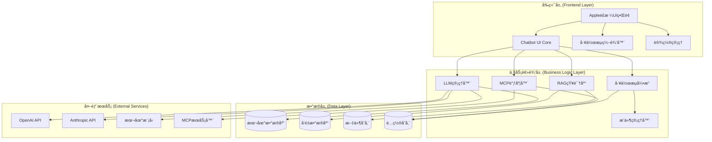

# Bor æ™ºèƒ½ä½“ä¸­æ¢ - 设计文档

## 概述

Bor 智能体中æ¢é‡‡ç”¨é©å‘½æ€§çš„"对è¯å³ç•Œé¢"设计ç†å¿µï¼Œæ‘’弃传统的èœå•ã€æŒ‰é’®ã€ä¾§è¾¹æ ç­‰å¤æ‚ç•Œé¢å…ƒç´ ï¼Œé€šè¿‡çº¯å¯¹è¯äº¤äº’å®ç°æ‰€æœ‰åŠŸèƒ½æ§åˆ¶ã€‚用户åªéœ€è¦é€šè¿‡è‡ªç„¶è¯­è¨€å³å¯å®Œæˆ LLM é…ç½®ã€çŸ¥è¯†åº“管ç†ã€å·¥ä½œæµåˆ›å»ºã€ç³»ç»Ÿè®¾ç½®ç­‰æ‰€æœ‰æ“作，打造æ简而强大的智能助手体验。

系统采用ç°ä»£åŒ–çš„ Web-First æ¶æ„，通过集æˆæˆç†Ÿçš„å¼€æºç»„件æ„建一个ç‘士军刀å¼çš„个人智能助手平å°ï¼Œæœ€ç»ˆé€šè¿‡ Electron 等技术打包为桌é¢åº”用。

## æ¶æ„设计

### 整体æ¶æ„



### 技术栈选择

#### å‰ç«¯æŠ€æœ¯æ ˆ
- **框æ¶**: Vue 3 + TypeScript + Vite
- **UI 基础**: Chatbot UI (定制化)
- **æ ·å¼**: Tailwind CSS + Apple Design System
- **状æ€ç®¡ç†**: Pinia
- **路由**: Vue Router
- **æ¡Œé¢åŒ–**: Electron

#### å端技术栈
- **è¿è¡Œæ—¶**: Node.js
- **框æ¶**: Express.js / Fastify
- **æ•°æ®åº“**: SQLite (本地) + Chroma (å‘é‡)
- **文件处ç†**: Multer + PDF.js
- **进程管ç†**: PM2

#### 集æˆç»„件
- **LLM 管ç†**: LLMChat Core
- **MCP åè®®**: @modelcontextprotocol/sdk
- **工作æµå¼•æ“**: 自研 + Temporal (å¯é€‰)

## 组件设计

### 1. Apple é£æ ¼ UI 组件

#### 设计系统
```typescript
// src/design-system/tokens.ts
export const DesignTokens = {
  colors: {
    primary: {
      blue: '#007AFF',
      indigo: '#5856D6',
      purple: '#AF52DE',
    },
    neutral: {
      white: '#FFFFFF',
      gray100: '#F2F2F7',
      gray200: '#E5E5EA',
      gray300: '#D1D1D6',
      gray400: '#C7C7CC',
      gray500: '#AEAEB2',
      gray600: '#8E8E93',
      black: '#000000',
    },
    semantic: {
      success: '#34C759',
      warning: '#FF9500',
      error: '#FF3B30',
    }
  },
  
  spacing: {
    xs: '4px',
    sm: '8px',
    md: '16px',
    lg: '24px',
    xl: '32px',
    xxl: '48px',
  },
  
  borderRadius: {
    sm: '6px',
    md: '12px',
    lg: '16px',
    xl: '20px',
  },
  
  typography: {
    fontFamily: {
      system: '-apple-system, BlinkMacSystemFont, "SF Pro Display", sans-serif',
      mono: '"SF Mono", Monaco, "Cascadia Code", monospace',
    },
    fontSize: {
      xs: '12px',
      sm: '14px',
      base: '16px',
      lg: '18px',
      xl: '20px',
      '2xl': '24px',
      '3xl': '30px',
    }
  },
  
  effects: {
    glassmorphism: {
      background: 'rgba(255, 255, 255, 0.8)',
      backdropFilter: 'blur(20px)',
      border: '1px solid rgba(255, 255, 255, 0.2)',
    },
    shadow: {
      sm: '0 1px 3px rgba(0, 0, 0, 0.1)',
      md: '0 4px 6px rgba(0, 0, 0, 0.1)',
      lg: '0 10px 15px rgba(0, 0, 0, 0.1)',
    }
  }
}
```

#### æ简对è¯ç•Œé¢ç»„件
```vue
<!-- src/components/ChatInterface.vue -->
<template>
  <div class="chat-interface-minimal">
    <!-- 纯净的消æ¯åˆ—表 - 无边框ã€æ— è£…饰 -->
    <div class="messages-container" ref="messagesContainer">
      <ChatMessage
        v-for="message in messages"
        :key="message.id"
        :message="message"
        :is-streaming="message.id === streamingMessageId"
        :show-system-controls="message.type === 'system-config'"
      />
    </div>
    
    <!-- æ简输入区域 - 无按钮ã€æ— èœå• -->
    <div class="input-area-minimal">
      <ChatInput
        v-model="inputText"
        :is-loading="isLoading"
        :placeholder="getContextualPlaceholder()"
        @send="handleIntelligentSend"
        @file-drop="handleFileDrop"
        @voice-input="handleVoiceInput"
      />
    </div>
  </div>
</template>

<script setup lang="ts">
import { ref, computed, onMounted } from 'vue'
import { useChatStore } from '@/stores/chat'
import { useLLMStore } from '@/stores/llm'
import ChatMessage from './ChatMessage.vue'
import ChatInput from './ChatInput.vue'

const chatStore = useChatStore()
const llmStore = useLLMStore()

const inputText = ref('')
const isLoading = ref(false)
const streamingMessageId = ref<string | null>(null)

const messages = computed(() => chatStore.currentConversation?.messages || [])
const availableTools = computed(() => chatStore.availableTools)

const handleIntelligentSend = async (content: string, attachments?: File[]) => {
  if (!content.trim() && !attachments?.length) return
  
  isLoading.value = true
  
  try {
    // 添加用户消æ¯
    const userMessage = await chatStore.addMessage({
      role: 'user',
      content,
      attachments
    })
    
    // 智能æ„图识别 - 通过对è¯æ§åˆ¶æ‰€æœ‰åŠŸèƒ½
    const intent = await intentRecognizer.analyze(content)
    
    switch (intent.type) {
      case 'system_config':
        await handleSystemConfig(content, intent.params)
        break
      case 'llm_management':
        await handleLLMManagement(content, intent.params)
        break
      case 'knowledge_base':
        await handleKnowledgeBase(content, intent.params, attachments)
        break
      case 'workflow_creation':
        await handleWorkflowRequest(content)
        break
      case 'mcp_management':
        await handleMCPManagement(content, intent.params)
        break
      default:
        await handleChatRequest(userMessage)
    }
  } catch (error) {
    console.error('å‘é€æ¶ˆæ¯å¤±è´¥:', error)
  } finally {
    isLoading.value = false
    inputText.value = ''
  }
}

const isWorkflowRequest = (content: string): boolean => {
  const workflowKeywords = ['创建工作æµ', '自动化', '定时任务', '批处ç†', '脚本']
  return workflowKeywords.some(keyword => content.includes(keyword))
}

const handleWorkflowRequest = async (content: string) => {
  // 调用工作æµç”ŸæˆæœåŠ¡
  const workflowService = useWorkflowService()
  const generatedWorkflow = await workflowService.generateFromDescription(content)
  
  // 显示生æˆçš„工作æµä¾›ç”¨æˆ·ç¡®è®¤
  await chatStore.addMessage({
    role: 'assistant',
    content: `我为您生æˆäº†ä»¥ä¸‹å·¥ä½œæµï¼Œè¯·ç¡®è®¤æ˜¯å¦ç¬¦åˆæ‚¨çš„需求：\n\n\`\`\`yaml\n${generatedWorkflow}\n\`\`\``,
    metadata: {
      type: 'workflow',
      workflow: generatedWorkflow
    }
  })
}
</script>
```

### 2. LLM 管ç†ç³»ç»Ÿ

#### LLM 管ç†å™¨æ¶æ„
```typescript
// src/services/llm/LLMManager.ts
import { LLMProvider, ChatRequest, ChatResponse } from './types'
import { OpenAIProvider } from './providers/OpenAIProvider'
import { AnthropicProvider } from './providers/AnthropicProvider'
import { OllamaProvider } from './providers/OllamaProvider'

export class LLMManager {
  private providers: Map<string, LLMProvider> = new Map()
  private defaultProvider: string = 'openai'
  
  constructor() {
    this.initializeProviders()
  }
  
  private initializeProviders() {
    // 注册å„ç§ LLM æ供商
    this.providers.set('openai', new OpenAIProvider())
    this.providers.set('anthropic', new AnthropicProvider())
    this.providers.set('ollama', new OllamaProvider())
  }
  
  async chat(request: ChatRequest): Promise<ChatResponse> {
    const provider = this.selectProvider(request)
    
    // é›†æˆ RAG å¢å¼º
    const enhancedRequest = await this.enhanceWithRAG(request)
    
    // 执行对è¯
    return await provider.chat(enhancedRequest)
  }
  
  private selectProvider(request: ChatRequest): LLMProvider {
    // 智能路由逻辑
    if (request.preferredModel) {
      const provider = this.providers.get(request.preferredModel)
      if (provider) return provider
    }
    
    // æ ¹æ®è¯·æ±‚ç±»å‹é€‰æ‹©æœ€é€‚åˆçš„模å‹
    if (request.requiresCodeGeneration) {
      return this.providers.get('anthropic') || this.providers.get('openai')!
    }
    
    if (request.requiresPrivacy) {
      return this.providers.get('ollama')!
    }
    
    return this.providers.get(this.defaultProvider)!
  }
  
  private async enhanceWithRAG(request: ChatRequest): Promise<ChatRequest> {
    const ragService = useRAGService()
    const relevantDocs = await ragService.search(request.content)
    
    if (relevantDocs.length > 0) {
      const context = relevantDocs.map(doc => doc.content).join('\n\n')
      request.content = `基äºä»¥ä¸‹ä¸Šä¸‹æ–‡ä¿¡æ¯å›ç­”问题：\n\n${context}\n\n问题：${request.content}`
    }
    
    return request
  }
}
```

#### 多供应商æ供商å®ç°
```typescript
// src/services/llm/providers/ProviderFactory.ts
import { LLMProvider } from '../types'
import { OllamaProvider } from './OllamaProvider'
import { OpenRouterProvider } from './OpenRouterProvider'
import { OpenAIProvider } from './OpenAIProvider'
import { OpenAICompatibleProvider } from './OpenAICompatibleProvider'
import { ZhipuProvider } from './ZhipuProvider'
import { GeminiProvider } from './GeminiProvider'

export class ProviderFactory {
  static createProvider(config: ProviderConfig): LLMProvider {
    switch (config.type) {
      case 'ollama':
        return new OllamaProvider(config)
      case 'openrouter':
        return new OpenRouterProvider(config)
      case 'openai':
        return new OpenAIProvider(config)
      case 'openai-compatible':
        return new OpenAICompatibleProvider(config)
      case 'zhipu':
        return new ZhipuProvider(config)
      case 'gemini':
        return new GeminiProvider(config)
      default:
        throw new Error(`ä¸æ”¯æŒçš„供应商类å‹: ${config.type}`)
    }
  }
}

// src/services/llm/providers/OllamaProvider.ts
export class OllamaProvider implements LLMProvider {
  private baseURL: string
  
  constructor(config: ProviderConfig) {
    this.baseURL = config.baseURL || 'http://localhost:11434'
  }
  
  async getAvailableModels(): Promise<string[]> {
    const response = await fetch(`${this.baseURL}/api/tags`)
    const data = await response.json()
    return data.models.map((model: any) => model.name)
  }
  
  async chat(request: ChatRequest): Promise<ChatResponse> {
    const response = await fetch(`${this.baseURL}/api/chat`, {
      method: 'POST',
      headers: { 'Content-Type': 'application/json' },
      body: JSON.stringify({
        model: request.model,
        messages: request.messages,
        stream: true
      })
    })
    
    return this.handleStreamResponse(response)
  }
}

// src/services/llm/providers/OpenRouterProvider.ts
export class OpenRouterProvider implements LLMProvider {
  private client: OpenAI
  
  constructor(config: ProviderConfig) {
    this.client = new OpenAI({
      apiKey: config.apiKey,
      baseURL: 'https://openrouter.ai/api/v1',
      defaultHeaders: {
        'HTTP-Referer': 'https://bor-ai.app',
        'X-Title': 'Bor智能体中æ¢'
      }
    })
  }
  
  async getAvailableModels(): Promise<string[]> {
    const response = await fetch('https://openrouter.ai/api/v1/models', {
      headers: {
        'Authorization': `Bearer ${this.config.apiKey}`
      }
    })
    const data = await response.json()
    return data.data.map((model: any) => model.id)
  }
}

// src/services/llm/providers/ZhipuProvider.ts
export class ZhipuProvider implements LLMProvider {
  private apiKey: string
  private baseURL: string = 'https://open.bigmodel.cn/api/paas/v4'
  
  constructor(config: ProviderConfig) {
    this.apiKey = config.apiKey
  }
  
  async chat(request: ChatRequest): Promise<ChatResponse> {
    const response = await fetch(`${this.baseURL}/chat/completions`, {
      method: 'POST',
      headers: {
        'Authorization': `Bearer ${this.apiKey}`,
        'Content-Type': 'application/json'
      },
      body: JSON.stringify({
        model: request.model || 'glm-4',
        messages: request.messages,
        stream: true
      })
    })
    
    return this.handleStreamResponse(response)
  }
  
  async getAvailableModels(): Promise<string[]> {
    return ['glm-4', 'glm-4v', 'glm-3-turbo']
  }
}

// src/services/llm/providers/GeminiProvider.ts
export class GeminiProvider implements LLMProvider {
  private apiKey: string
  private baseURL: string = 'https://generativelanguage.googleapis.com/v1beta'
  
  constructor(config: ProviderConfig) {
    this.apiKey = config.apiKey
  }
  
  async chat(request: ChatRequest): Promise<ChatResponse> {
    // 转æ¢æ¶ˆæ¯æ ¼å¼ä¸ºGeminiæ ¼å¼
    const geminiMessages = this.convertToGeminiFormat(request.messages)
    
    const response = await fetch(`${this.baseURL}/models/${request.model}:streamGenerateContent?key=${this.apiKey}`, {
      method: 'POST',
      headers: { 'Content-Type': 'application/json' },
      body: JSON.stringify({
        contents: geminiMessages,
        generationConfig: {
          temperature: request.temperature || 0.7
        }
      })
    })
    
    return this.handleGeminiStreamResponse(response)
  }
  
  async getAvailableModels(): Promise<string[]> {
    return ['gemini-1.5-pro', 'gemini-1.5-flash', 'gemini-pro-vision']
  }
}
  
  async chat(request: ChatRequest): Promise<ChatResponse> {
    const stream = await this.client.chat.completions.create({
      model: request.model || 'gpt-4',
      messages: request.messages,
      stream: true,
      tools: request.availableTools?.map(tool => ({
        type: 'function',
        function: {
          name: tool.name,
          description: tool.description,
          parameters: tool.parameters
        }
      }))
    })
    
    return this.handleStreamResponse(stream)
  }
  
  private async handleStreamResponse(stream: any): Promise<ChatResponse> {
    let content = ''
    const toolCalls: any[] = []
    
    for await (const chunk of stream) {
      const delta = chunk.choices[0]?.delta
      
      if (delta?.content) {
        content += delta.content
        // å‘é€æµå¼æ›´æ–°äº‹ä»¶
        this.emitStreamUpdate(delta.content)
      }
      
      if (delta?.tool_calls) {
        toolCalls.push(...delta.tool_calls)
      }
    }
    
    return {
      content,
      toolCalls,
      usage: stream.usage
    }
  }
  
  private emitStreamUpdate(content: string) {
    // å‘é€å®æ—¶æ›´æ–°äº‹ä»¶ç»™å‰ç«¯
    window.electronAPI?.sendStreamUpdate(content)
  }
}
```

### 3. RAG 知识库系统

#### 知识库管ç†å™¨
```typescript
// src/services/rag/RAGService.ts
import { ChromaClient } from 'chromadb'
import { Document, SearchResult } from './types'

export class RAGService {
  private chromaClient: ChromaClient
  private collection: any
  
  constructor() {
    this.chromaClient = new ChromaClient({
      path: 'http://localhost:8000'
    })
    this.initializeCollection()
  }
  
  private async initializeCollection() {
    this.collection = await this.chromaClient.getOrCreateCollection({
      name: 'bor-knowledge-base',
      metadata: { description: 'Bor智能体中æ¢çŸ¥è¯†åº“' }
    })
  }
  
  async addDocument(document: Document): Promise<void> {
    // 文档分å—
    const chunks = this.chunkDocument(document)
    
    // 生æˆå‘é‡åµŒå…¥
    const embeddings = await this.generateEmbeddings(chunks)
    
    // 存储到å‘é‡æ•°æ®åº“
    await this.collection.add({
      ids: chunks.map((_, index) => `${document.id}_chunk_${index}`),
      embeddings,
      documents: chunks.map(chunk => chunk.content),
      metadatas: chunks.map(chunk => ({
        documentId: document.id,
        title: document.title,
        type: document.type,
        chunkIndex: chunk.index
      }))
    })
  }
  
  async search(query: string, limit: number = 5): Promise<SearchResult[]> {
    const queryEmbedding = await this.generateEmbeddings([query])
    
    const results = await this.collection.query({
      queryEmbeddings: queryEmbedding,
      nResults: limit,
      include: ['documents', 'metadatas', 'distances']
    })
    
    return results.documents[0].map((doc: string, index: number) => ({
      content: doc,
      metadata: results.metadatas[0][index],
      similarity: 1 - results.distances[0][index]
    }))
  }
  
  private chunkDocument(document: Document): DocumentChunk[] {
    // 智能分å—算法
    const maxChunkSize = 1000
    const overlap = 200
    
    const chunks: DocumentChunk[] = []
    let startIndex = 0
    
    while (startIndex < document.content.length) {
      const endIndex = Math.min(startIndex + maxChunkSize, document.content.length)
      const chunkContent = document.content.slice(startIndex, endIndex)
      
      chunks.push({
        content: chunkContent,
        index: chunks.length,
        startIndex,
        endIndex
      })
      
      startIndex = endIndex - overlap
    }
    
    return chunks
  }
  
  private async generateEmbeddings(texts: string[]): Promise<number[][]> {
    // 使用本地嵌入模å‹æˆ–调用 API
    const response = await fetch('/api/embeddings', {
      method: 'POST',
      headers: { 'Content-Type': 'application/json' },
      body: JSON.stringify({ texts })
    })
    
    const data = await response.json()
    return data.embeddings
  }
}
```

### 4. MCP 调度系统

#### MCP 管ç†å™¨
```typescript
// src/services/mcp/MCPManager.ts
import { Client, Server, Transport } from '@modelcontextprotocol/sdk'
import { MCPServerConfig, ToolInfo } from './types'

export class MCPManager {
  private servers: Map<string, MCPServerInstance> = new Map()
  private client: Client
  
  constructor() {
    this.client = new Client({
      name: 'bor-intelligent-agent',
      version: '1.0.0'
    })
    
    this.loadServerConfigs()
  }
  
  private async loadServerConfigs() {
    const configs = await this.getServerConfigs()
    
    for (const config of configs) {
      await this.registerServer(config)
    }
  }
  
  async registerServer(config: MCPServerConfig): Promise<void> {
    try {
      const transport = this.createTransport(config)
      const server = new MCPServerInstance(config.name, transport)
      
      await server.connect()
      this.servers.set(config.name, server)
      
      console.log(`MCPæœåŠ¡å™¨ ${config.name} 注册æˆåŠŸ`)
    } catch (error) {
      console.error(`注册MCPæœåŠ¡å™¨ ${config.name} 失败:`, error)
    }
  }
  
  async callTool(serverName: string, toolName: string, args: any): Promise<any> {
    const server = this.servers.get(serverName)
    if (!server) {
      throw new Error(`MCPæœåŠ¡å™¨ ${serverName} 未找到`)
    }
    
    return await server.callTool(toolName, args)
  }
  
  async listAvailableTools(): Promise<ToolInfo[]> {
    const allTools: ToolInfo[] = []
    
    for (const [serverName, server] of this.servers) {
      try {
        const tools = await server.listTools()
        allTools.push(...tools.map(tool => ({
          ...tool,
          serverName
        })))
      } catch (error) {
        console.error(`è·å–æœåŠ¡å™¨ ${serverName} 工具列表失败:`, error)
      }
    }
    
    return allTools
  }
  
  private createTransport(config: MCPServerConfig): Transport {
    switch (config.transport.type) {
      case 'stdio':
        return new StdioTransport(config.transport.command, config.transport.args)
      case 'websocket':
        return new WebSocketTransport(config.transport.url)
      default:
        throw new Error(`ä¸æ”¯æŒçš„传输类å‹: ${config.transport.type}`)
    }
  }
  
  private async getServerConfigs(): Promise<MCPServerConfig[]> {
    // ä»é…置文件加载 MCP æœåŠ¡å™¨é…ç½®
    const configPath = path.join(app.getPath('userData'), 'mcp-servers.json')
    
    if (!fs.existsSync(configPath)) {
      // 创建默认é…ç½®
      const defaultConfigs = this.getDefaultServerConfigs()
      await fs.promises.writeFile(configPath, JSON.stringify(defaultConfigs, null, 2))
      return defaultConfigs
    }
    
    const configData = await fs.promises.readFile(configPath, 'utf-8')
    return JSON.parse(configData)
  }
  
  private getDefaultServerConfigs(): MCPServerConfig[] {
    return [
      {
        name: 'filesystem',
        transport: {
          type: 'stdio',
          command: 'npx',
          args: ['@modelcontextprotocol/server-filesystem', './workspace']
        },
        autoStart: true
      },
      {
        name: 'brave-search',
        transport: {
          type: 'stdio',
          command: 'npx',
          args: ['@modelcontextprotocol/server-brave-search']
        },
        autoStart: false,
        env: {
          BRAVE_API_KEY: process.env.BRAVE_API_KEY || ''
        }
      }
    ]
  }
}
```

### 5. 对è¯å¼å·¥ä½œæµç³»ç»Ÿ

#### 工作æµç”Ÿæˆå™¨
```typescript
// src/services/workflow/WorkflowGenerator.ts
export class WorkflowGenerator {
  private llmManager: LLMManager
  
  constructor(llmManager: LLMManager) {
    this.llmManager = llmManager
  }
  
  async generateFromDescription(description: string): Promise<WorkflowDefinition> {
    const prompt = this.buildGenerationPrompt(description)
    
    const response = await this.llmManager.chat({
      content: prompt,
      model: 'gpt-4',
      temperature: 0.1
    })
    
    // 解æ生æˆçš„工作æµ
    const workflowYaml = this.extractYamlFromResponse(response.content)
    const workflow = this.parseWorkflow(workflowYaml)
    
    // 验è¯å·¥ä½œæµ
    this.validateWorkflow(workflow)
    
    return workflow
  }
  
  private buildGenerationPrompt(description: string): string {
    return `
作为一个工作æµä¸“家，请根æ®ç”¨æˆ·çš„æ述生æˆä¸€ä¸ªYAMLæ ¼å¼çš„工作æµå®šä¹‰ã€‚

用户æ述：${description}

请生æˆä¸€ä¸ªåŒ…å«ä»¥ä¸‹ç»“æ„的工作æµï¼š
- name: 工作æµå称
- description: 工作æµæè¿°
- triggers: 触å‘æ¡ä»¶
- steps: 执行步骤
- error_handling: 错误处ç†

æ¯ä¸ªæ­¥éª¤åº”该包å«ï¼š
- name: 步骤å称
- type: æ­¥éª¤ç±»å‹ (llm_call, mcp_tool, condition, loopç­‰)
- config: 步骤é…ç½®
- next: 下一步骤

请确ä¿ç”Ÿæˆçš„工作æµæ˜¯å¯æ‰§è¡Œçš„，并且符åˆYAML语法规范。

示例格å¼ï¼š
\`\`\`yaml
name: "示例工作æµ"
description: "这是一个示例工作æµ"
triggers:
  - type: "manual"
steps:
  - name: "步骤1"
    type: "llm_call"
    config:
      model: "gpt-4"
      prompt: "分æ用户输入"
    next: "步骤2"
\`\`\`
`
  }
  
  async optimizeWorkflow(workflow: WorkflowDefinition, feedback: string): Promise<WorkflowDefinition> {
    const prompt = `
请根æ®ç”¨æˆ·å馈优化以下工作æµï¼š

当å‰å·¥ä½œæµï¼š
\`\`\`yaml
${this.workflowToYaml(workflow)}
\`\`\`

用户å馈：${feedback}

请æ供优化å的工作æµå®šä¹‰ã€‚
`
    
    const response = await this.llmManager.chat({
      content: prompt,
      model: 'gpt-4',
      temperature: 0.1
    })
    
    const optimizedYaml = this.extractYamlFromResponse(response.content)
    return this.parseWorkflow(optimizedYaml)
  }
}
```

#### 工作æµæ‰§è¡Œå¼•æ“
```typescript
// src/services/workflow/WorkflowEngine.ts
export class WorkflowEngine {
  private mcpManager: MCPManager
  private llmManager: LLMManager
  private executionContext: Map<string, any> = new Map()
  
  async executeWorkflow(workflow: WorkflowDefinition, input?: any): Promise<WorkflowResult> {
    const executionId = this.generateExecutionId()
    const context = new WorkflowExecutionContext(executionId, workflow, input)
    
    try {
      // åˆå§‹åŒ–执行上下文
      this.executionContext.set(executionId, context)
      
      // 执行工作æµæ­¥éª¤
      const result = await this.executeSteps(workflow.steps, context)
      
      return {
        executionId,
        status: 'completed',
        result,
        executionTime: Date.now() - context.startTime
      }
    } catch (error) {
      return {
        executionId,
        status: 'failed',
        error: error.message,
        executionTime: Date.now() - context.startTime
      }
    } finally {
      this.executionContext.delete(executionId)
    }
  }
  
  private async executeSteps(steps: WorkflowStep[], context: WorkflowExecutionContext): Promise<any> {
    let currentStep = steps[0]
    let result: any = context.input
    
    while (currentStep) {
      try {
        // 更新执行状æ€
        context.currentStep = currentStep.name
        this.emitExecutionUpdate(context)
        
        // 执行当å‰æ­¥éª¤
        result = await this.executeStep(currentStep, result, context)
        
        // 确定下一步
        currentStep = this.getNextStep(currentStep, result, steps)
        
      } catch (error) {
        // 错误处ç†
        if (currentStep.errorHandling) {
          result = await this.handleStepError(error, currentStep, context)
          currentStep = this.getNextStep(currentStep, result, steps)
        } else {
          throw error
        }
      }
    }
    
    return result
  }
  
  private async executeStep(step: WorkflowStep, input: any, context: WorkflowExecutionContext): Promise<any> {
    switch (step.type) {
      case 'llm_call':
        return await this.executeLLMStep(step, input, context)
      
      case 'mcp_tool':
        return await this.executeMCPStep(step, input, context)
      
      case 'condition':
        return await this.executeConditionStep(step, input, context)
      
      case 'loop':
        return await this.executeLoopStep(step, input, context)
      
      case 'parallel':
        return await this.executeParallelStep(step, input, context)
      
      default:
        throw new Error(`ä¸æ”¯æŒçš„步骤类å‹: ${step.type}`)
    }
  }
  
  private async executeLLMStep(step: WorkflowStep, input: any, context: WorkflowExecutionContext): Promise<any> {
    const config = step.config as LLMStepConfig
    
    const response = await this.llmManager.chat({
      content: this.interpolateTemplate(config.prompt, { input, context: context.variables }),
      model: config.model || 'gpt-4',
      temperature: config.temperature || 0.7
    })
    
    return response.content
  }
  
  private async executeMCPStep(step: WorkflowStep, input: any, context: WorkflowExecutionContext): Promise<any> {
    const config = step.config as MCPStepConfig
    
    const args = this.interpolateObject(config.args, { input, context: context.variables })
    
    return await this.mcpManager.callTool(config.server, config.tool, args)
  }
}
```

## æ•°æ®æ¨¡å‹

### 核心数æ®ç»“æ„
```typescript
// src/types/core.ts

export interface Message {
  id: string
  role: 'user' | 'assistant' | 'system'
  content: string
  attachments?: Attachment[]
  metadata?: MessageMetadata
  timestamp: number
}

export interface Conversation {
  id: string
  title: string
  messages: Message[]
  model?: string
  createdAt: number
  updatedAt: number
}

export interface Document {
  id: string
  title: string
  content: string
  type: 'pdf' | 'docx' | 'txt' | 'md'
  size: number
  uploadedAt: number
  vectorized: boolean
}

export interface WorkflowDefinition {
  id: string
  name: string
  description: string
  version: string
  triggers: WorkflowTrigger[]
  steps: WorkflowStep[]
  variables?: Record<string, any>
  createdAt: number
  updatedAt: number
}

export interface MCPServerConfig {
  name: string
  transport: {
    type: 'stdio' | 'websocket'
    command?: string
    args?: string[]
    url?: string
  }
  env?: Record<string, string>
  autoStart: boolean
  healthCheck?: {
    interval: number
    timeout: number
  }
}
```

## 错误处ç†

### 统一错误处ç†æœºåˆ¶
```typescript
// src/utils/errorHandler.ts
export class ErrorHandler {
  static handle(error: Error, context?: string): void {
    // 记录错误日志
    console.error(`[${context || 'Unknown'}] ${error.message}`, error.stack)
    
    // å‘é€é”™è¯¯æŠ¥å‘Š
    this.reportError(error, context)
    
    // 显示用户å‹å¥½çš„错误信æ¯
    this.showUserError(error)
  }
  
  private static reportError(error: Error, context?: string): void {
    // å‘é€åˆ°é”™è¯¯ç›‘æ§æœåŠ¡
    if (process.env.NODE_ENV === 'production') {
      // Sentry.captureException(error, { tags: { context } })
    }
  }
  
  private static showUserError(error: Error): void {
    const userMessage = this.getUserFriendlyMessage(error)
    
    // 通过 UI 显示错误
    window.electronAPI?.showError(userMessage)
  }
  
  private static getUserFriendlyMessage(error: Error): string {
    if (error.message.includes('API key')) {
      return '请检查您的 API 密钥é…ç½®'
    }
    
    if (error.message.includes('network')) {
      return '网络è¿æ¥å¼‚常，请检查网络设置'
    }
    
    if (error.message.includes('MCP')) {
      return 'MCP æœåŠ¡å™¨è¿æ¥å¤±è´¥ï¼Œè¯·æ£€æŸ¥æœåŠ¡å™¨çŠ¶æ€'
    }
    
    return 'æ“作失败，请ç¨åé‡è¯•'
  }
}
```

## 测试策略

### 测试æ¶æ„
```typescript
// tests/unit/services/LLMManager.test.ts
import { describe, it, expect, vi } from 'vitest'
import { LLMManager } from '@/services/llm/LLMManager'

describe('LLMManager', () => {
  it('应该能够正确路由到åˆé€‚的模å‹æ供商', async () => {
    const llmManager = new LLMManager()
    
    const request = {
      content: '请帮我写一段代ç ',
      requiresCodeGeneration: true
    }
    
    const response = await llmManager.chat(request)
    
    expect(response).toBeDefined()
    expect(response.content).toContain('代ç ')
  })
  
  it('åº”è¯¥èƒ½å¤Ÿé›†æˆ RAG å¢å¼ºè¯·æ±‚', async () => {
    const llmManager = new LLMManager()
    
    // Mock RAG æœåŠ¡
    vi.mock('@/services/rag/RAGService', () => ({
      search: vi.fn().mockResolvedValue([
        { content: '相关文档内容', similarity: 0.8 }
      ])
    }))
    
    const request = {
      content: 'å…³äºé¡¹ç›®çš„问题'
    }
    
    const response = await llmManager.chat(request)
    
    expect(response.content).toBeDefined()
  })
})
```

### 集æˆæµ‹è¯•
```typescript
// tests/integration/workflow.test.ts
import { describe, it, expect } from 'vitest'
import { WorkflowEngine } from '@/services/workflow/WorkflowEngine'
import { WorkflowGenerator } from '@/services/workflow/WorkflowGenerator'

describe('工作æµç³»ç»Ÿé›†æˆæµ‹è¯•', () => {
  it('应该能够ä»æ述生æˆå¹¶æ‰§è¡Œå·¥ä½œæµ', async () => {
    const generator = new WorkflowGenerator()
    const engine = new WorkflowEngine()
    
    // 生æˆå·¥ä½œæµ
    const workflow = await generator.generateFromDescription(
      '创建一个æ¯å¤©å®šæ—¶å‘é€é‚®ä»¶çš„工作æµ'
    )
    
    expect(workflow.name).toBeDefined()
    expect(workflow.steps).toHaveLength.greaterThan(0)
    
    // 执行工作æµ
    const result = await engine.executeWorkflow(workflow, {
      recipient: 'test@example.com',
      subject: '测试邮件'
    })
    
    expect(result.status).toBe('completed')
  })
})
```

这个设计文档涵盖了系统的核心æ¶æ„ã€ä¸»è¦ç»„件设计ã€æ•°æ®æ¨¡å‹å’Œæµ‹è¯•ç­–略。设计充分考虑了你æ出的需求，特别是 Apple é£æ ¼ç•Œé¢ã€å¯¹è¯å¼å·¥ä½œæµå’Œç³»ç»Ÿæ‰©å±•æ€§ã€‚
### 6
. 对è¯å¼ç³»ç»Ÿæ§åˆ¶

#### æ„图识别系统
```typescript
// src/services/intent/IntentRecognizer.ts
export class IntentRecognizer {
  private llmManager: LLMManager
  
  constructor(llmManager: LLMManager) {
    this.llmManager = llmManager
  }
  
  async analyze(userInput: string): Promise<IntentResult> {
    const prompt = this.buildIntentPrompt(userInput)
    
    const response = await this.llmManager.chat({
      content: prompt,
      model: 'gpt-4',
      temperature: 0.1
    })
    
    return this.parseIntentResponse(response.content)
  }
  
  private buildIntentPrompt(userInput: string): string {
    return `
分æ用户输入的æ„图，判断用户想è¦æ‰§è¡Œä»€ä¹ˆæ“作。

用户输入：${userInput}

请ä»ä»¥ä¸‹æ„图类å‹ä¸­é€‰æ‹©æœ€åŒ¹é…的一个：

1. system_config - 系统é…置相关
   示例：切æ¢ä¸»é¢˜ã€ä¿®æ”¹è®¾ç½®ã€è°ƒæ•´ç•Œé¢
   
2. llm_management - LLM模å‹ç®¡ç†
   示例：切æ¢æ¨¡å‹ã€é…ç½®LLMã€ç®¡ç†æ¨¡å‹å‚æ•°
   
3. knowledge_base - 知识库管ç†
   示例：上传文档ã€æœç´¢çŸ¥è¯†ã€ç®¡ç†æ–‡ä»¶
   
4. workflow_creation - 工作æµåˆ›å»º
   示例：创建自动化任务ã€å®šæ—¶ä»»åŠ¡ã€æ‰¹å¤„ç†
   
5. mcp_management - MCP工具管ç†
   示例：添加工具ã€é…ç½®æœåŠ¡å™¨ã€è°ƒç”¨å·¥å…·
   
6. general_chat - 普通对è¯
   示例：问答ã€é—²èŠã€å’¨è¯¢

请以JSONæ ¼å¼è¿”å›ç»“æœï¼š
{
  "type": "æ„图类å‹",
  "confidence": 0.95,
  "params": {
    "具体å‚æ•°": "å‚数值"
  },
  "explanation": "识别ç†ç”±"
}
`
  }
  
  private parseIntentResponse(response: string): IntentResult {
    try {
      const jsonMatch = response.match(/\{[\s\S]*\}/)
      if (jsonMatch) {
        return JSON.parse(jsonMatch[0])
      }
    } catch (error) {
      console.error('解ææ„图å“应失败:', error)
    }
    
    // 默认返å›æ™®é€šå¯¹è¯æ„图
    return {
      type: 'general_chat',
      confidence: 0.5,
      params: {},
      explanation: '无法识别具体æ„图，默认为普通对è¯'
    }
  }
}
```

#### 对è¯å¼ç³»ç»Ÿé…ç½®
```typescript
// src/services/config/DialogueConfigManager.ts
export class DialogueConfigManager {
  private configStore: ConfigStore
  private llmManager: LLMManager
  
  async handleSystemConfig(userInput: string, params: any): Promise<string> {
    // 解æé…ç½®æ„图
    const configIntent = await this.parseConfigIntent(userInput)
    
    switch (configIntent.action) {
      case 'theme_change':
        return await this.handleThemeChange(configIntent.value)
      
      case 'api_key_setup':
        return await this.handleApiKeySetup(configIntent.provider, configIntent.key)
      
      case 'model_switch':
        return await this.handleModelSwitch(configIntent.model)
      
      case 'settings_view':
        return await this.handleSettingsView()
      
      default:
        return await this.handleGenericConfig(userInput)
    }
  }
  
  private async handleThemeChange(theme: 'light' | 'dark' | 'auto'): Promise<string> {
    await this.configStore.updateTheme(theme)
    
    // 应用主题å˜æ›´
    document.documentElement.setAttribute('data-theme', theme)
    
    return `已切æ¢åˆ°${theme === 'light' ? '浅色' : theme === 'dark' ? '深色' : '自动'}主题`
  }
  
  private async handleApiKeySetup(provider: string): Promise<string> {
    // 打开安全的é…置页é¢è€Œä¸æ˜¯åœ¨å¯¹è¯ä¸­å¤„ç†æ•æ„Ÿä¿¡æ¯
    await this.openSecureConfigPage('api-keys', { provider })
    
    return `正在打开${provider} API密钥é…置页é¢...

为了ä¿æŠ¤æ‚¨çš„éšç§å’Œå®‰å…¨ï¼ŒAPI密钥等æ•æ„Ÿä¿¡æ¯å°†åœ¨ä¸“门的安全é…置页é¢ä¸­å¤„ç†ï¼Œä¸ä¼šåœ¨å¯¹è¯è®°å½•ä¸­ç•™ä¸‹ç—•è¿¹ã€‚`
  }
  
  private async handleModelSwitch(model: string): Promise<string> {
    const availableModels = await this.llmManager.getAvailableModels()
    
    if (!availableModels.includes(model)) {
      const suggestions = availableModels.slice(0, 3).join('ã€')
      return `æ¨¡å‹ ${model} ä¸å¯ç”¨ã€‚å¯ç”¨æ¨¡å‹ï¼š${suggestions}`
    }
    
    await this.configStore.setDefaultModel(model)
    
    return `已切æ¢åˆ° ${model} 模å‹`
  }
  
  private async handleSettingsView(): Promise<string> {
    const currentSettings = await this.configStore.getAllSettings()
    
    return `当å‰ç³»ç»Ÿè®¾ç½®ï¼š
    
🨠主题：${currentSettings.theme}
🤖 默认模å‹ï¼š${currentSettings.defaultModel}
🔑 å·²é…置的API：${currentSettings.configuredApis.join('ã€')}
📚 知识库文档数：${currentSettings.knowledgeBaseCount}
âš™ï¸ MCPæœåŠ¡å™¨æ•°ï¼š${currentSettings.mcpServerCount}

需è¦ä¿®æ”¹ä»»ä½•è®¾ç½®ï¼Œè¯·ç›´æ¥å‘Šè¯‰æˆ‘ï¼`
  }
}
```

#### 对è¯å¼çŸ¥è¯†åº“管ç†
```typescript
// src/services/knowledge/DialogueKnowledgeManager.ts
export class DialogueKnowledgeManager {
  private ragService: RAGService
  
  async handleKnowledgeBase(userInput: string, params: any, attachments?: File[]): Promise<string> {
    const action = await this.parseKnowledgeAction(userInput)
    
    switch (action.type) {
      case 'upload_document':
        return await this.handleDocumentUpload(attachments, action.metadata)
      
      case 'search_knowledge':
        return await this.handleKnowledgeSearch(action.query)
      
      case 'list_documents':
        return await this.handleDocumentList()
      
      case 'delete_document':
        return await this.handleDocumentDelete(action.documentId)
      
      default:
        return await this.handleGenericKnowledge(userInput)
    }
  }
  
  private async handleDocumentUpload(files?: File[], metadata?: any): Promise<string> {
    if (!files || files.length === 0) {
      return '请拖拽文件到对è¯æ¡†ï¼Œæˆ–者说"上传文档"然å选择文件'
    }
    
    const results = []
    
    for (const file of files) {
      try {
        const document = await this.processFile(file)
        await this.ragService.addDocument(document)
        results.push(`✅ ${file.name} 上传æˆåŠŸ`)
      } catch (error) {
        results.push(`⌠${file.name} 上传失败：${error.message}`)
      }
    }
    
    return `文档上传结æœï¼š\n${results.join('\n')}\n\nç°åœ¨æ‚¨å¯ä»¥åŸºäºè¿™äº›æ–‡æ¡£è¿›è¡Œé—®ç­”了ï¼`
  }
  
  private async handleKnowledgeSearch(query: string): Promise<string> {
    const results = await this.ragService.search(query, 3)
    
    if (results.length === 0) {
      return '没有找到相关的知识库内容。您å¯ä»¥ä¸Šä¼ ç›¸å…³æ–‡æ¡£æ¥ä¸°å¯ŒçŸ¥è¯†åº“。'
    }
    
    const formattedResults = results.map((result, index) => 
      `${index + 1}. **${result.metadata.title}** (相似度: ${(result.similarity * 100).toFixed(1)}%)\n${result.content.substring(0, 200)}...`
    ).join('\n\n')
    
    return `找到以下相关内容：\n\n${formattedResults}`
  }
}
```

#### 对è¯å¼å·¥ä½œæµç®¡ç†
```typescript
// src/services/workflow/DialogueWorkflowManager.ts
export class DialogueWorkflowManager {
  private workflowGenerator: WorkflowGenerator
  private workflowEngine: WorkflowEngine
  
  async handleWorkflowRequest(userInput: string): Promise<string> {
    const workflowIntent = await this.parseWorkflowIntent(userInput)
    
    switch (workflowIntent.action) {
      case 'create':
        return await this.handleWorkflowCreation(workflowIntent.description)
      
      case 'execute':
        return await this.handleWorkflowExecution(workflowIntent.workflowId, workflowIntent.params)
      
      case 'list':
        return await this.handleWorkflowList()
      
      case 'modify':
        return await this.handleWorkflowModification(workflowIntent.workflowId, workflowIntent.changes)
      
      default:
        return await this.handleGenericWorkflow(userInput)
    }
  }
  
  private async handleWorkflowCreation(description: string): Promise<string> {
    try {
      // 生æˆå·¥ä½œæµ
      const workflow = await this.workflowGenerator.generateFromDescription(description)
      
      // ä¿å­˜å·¥ä½œæµ
      const savedWorkflow = await this.workflowEngine.saveWorkflow(workflow)
      
      return `✅ 工作æµåˆ›å»ºæˆåŠŸï¼

**工作æµå称：** ${workflow.name}
**æ述：** ${workflow.description}
**步骤数：** ${workflow.steps.length}

工作æµå·²ä¿å­˜ï¼Œæ‚¨å¯ä»¥è¯´"æ‰§è¡Œå·¥ä½œæµ ${workflow.name}"æ¥è¿è¡Œå®ƒï¼Œæˆ–者说"修改工作æµ"æ¥è°ƒæ•´é…置。

需è¦ç«‹å³æ‰§è¡Œè¿™ä¸ªå·¥ä½œæµå—？`
      
    } catch (error) {
      return `⌠工作æµåˆ›å»ºå¤±è´¥ï¼š${error.message}\n\n请å°è¯•æ›´è¯¦ç»†åœ°æ述您想è¦çš„自动化任务。`
    }
  }
  
  private async handleWorkflowExecution(workflowId: string, params?: any): Promise<string> {
    try {
      const result = await this.workflowEngine.executeWorkflow(workflowId, params)
      
      if (result.status === 'completed') {
        return `✅ 工作æµæ‰§è¡ŒæˆåŠŸï¼\n\n执行时间：${result.executionTime}ms\n结æœï¼š${JSON.stringify(result.result, null, 2)}`
      } else {
        return `⌠工作æµæ‰§è¡Œå¤±è´¥ï¼š${result.error}`
      }
      
    } catch (error) {
      return `⌠工作æµæ‰§è¡Œå‡ºé”™ï¼š${error.message}`
    }
  }
}
```

这样的设计å®ç°äº†çœŸæ­£çš„"对è¯å³ç•Œé¢"体验：

1. **æ简界é¢**：åªæœ‰ä¸€ä¸ªå¯¹è¯æ¡†ï¼Œæ²¡æœ‰ä»»ä½•ä¼ ç»ŸUI元素
2. **智能æ„图识别**：通过LLMç†è§£ç”¨æˆ·çš„自然语言指令
3. **对è¯å¼é…ç½®**：所有系统设置都通过对è¯å®Œæˆ
4. **上下文感知**：根æ®å½“å‰çŠ¶æ€æ供相应的æ示和建议
5. **多模æ€äº¤äº’**：支æŒæ–‡æœ¬ã€æ–‡ä»¶æ‹–拽ã€è¯­éŸ³è¾“å…¥

用户å¯ä»¥è¯´ï¼š
- "切æ¢åˆ°æ·±è‰²ä¸»é¢˜"
- "设置OpenAI API密钥"
- "上传这些PDF文档到知识库"
- "创建一个æ¯å¤©å‘é€é‚®ä»¶çš„工作æµ"
- "显示当å‰ç³»ç»Ÿè®¾ç½®"

所有æ“作都通过自然对è¯å®Œæˆï¼Œæ— éœ€ä»»ä½•ä¼ ç»Ÿç•Œé¢å…ƒç´ ã€‚### 7.
 安全é…置页é¢ç³»ç»Ÿ

#### é…置页é¢ç®¡ç†å™¨
```typescript
// src/services/config/SecureConfigManager.ts
export class SecureConfigManager {
  private configWindows: Map<string, BrowserWindow> = new Map()
  
  async openSecureConfigPage(configType: string, params?: any): Promise<void> {
    // 检查是å¦å·²æœ‰é…置窗å£æ‰“å¼€
    const existingWindow = this.configWindows.get(configType)
    if (existingWindow && !existingWindow.isDestroyed()) {
      existingWindow.focus()
      return
    }
    
    // 创建安全的é…置窗å£
    const configWindow = new BrowserWindow({
      width: 600,
      height: 400,
      modal: true,
      resizable: false,
      webPreferences: {
        nodeIntegration: false,
        contextIsolation: true,
        preload: path.join(__dirname, 'config-preload.js')
      },
      titleBarStyle: 'hiddenInset', // macOSé£æ ¼
      vibrancy: 'under-window' // 毛ç»ç’ƒæ•ˆæœ
    })
    
    // 加载对应的é…置页é¢
    await configWindow.loadFile(`config-pages/${configType}.html`, {
      query: params ? new URLSearchParams(params).toString() : undefined
    })
    
    // 存储窗å£å¼•ç”¨
    this.configWindows.set(configType, configWindow)
    
    // 窗å£å…³é—­æ—¶æ¸…ç†å¼•ç”¨
    configWindow.on('closed', () => {
      this.configWindows.delete(configType)
    })
  }
  
  async handleConfigComplete(configType: string, data: any): Promise<void> {
    // 安全处ç†é…置数æ®
    switch (configType) {
      case 'api-keys':
        await this.handleApiKeyConfig(data)
        break
      case 'llm-settings':
        await this.handleLLMConfig(data)
        break
      case 'system-settings':
        await this.handleSystemConfig(data)
        break
    }
    
    // 关闭é…置窗å£
    const window = this.configWindows.get(configType)
    if (window && !window.isDestroyed()) {
      window.close()
    }
    
    // 通知主窗å£é…置完æˆ
    this.notifyMainWindow(configType, 'completed')
  }
  
  private async handleApiKeyConfig(data: any): Promise<void> {
    // 加密存储API密钥
    const encryptedKey = await this.encryptSensitiveData(data.apiKey)
    
    await this.configStore.setSecureConfig(`api_key_${data.provider}`, encryptedKey)
    
    // 验è¯API密钥有效性
    const isValid = await this.validateApiKey(data.provider, data.apiKey)
    if (!isValid) {
      throw new Error('API密钥验è¯å¤±è´¥')
    }
  }
}
```

#### 对è¯å¼é…置调度
```typescript
// 更新对è¯å¼é…置管ç†å™¨
export class DialogueConfigManager {
  private secureConfigManager: SecureConfigManager
  
  async handleSystemConfig(userInput: string, params: any): Promise<string> {
    const configIntent = await this.parseConfigIntent(userInput)
    
    switch (configIntent.action) {
      case 'open_bor_config':
        await this.secureConfigManager.openSecureConfigPage('system-settings')
        return '正在打开Bor系统é…置页é¢...'
      
      case 'open_llm_config':
        await this.secureConfigManager.openSecureConfigPage('llm-settings')
        return '正在打开LLMé…置页é¢ï¼Œæ‚¨å¯ä»¥åœ¨å…¶ä¸­å®‰å…¨åœ°ç®¡ç†API密钥和模å‹è®¾ç½®...'
      
      case 'theme_change':
        return await this.handleThemeChange(configIntent.value)
      
      case 'model_switch':
        return await this.handleModelSwitch(configIntent.model)
      
      case 'settings_view':
        return await this.handleSettingsView()
      
      default:
        return await this.handleGenericConfig(userInput)
    }
  }
  
  private async parseConfigIntent(userInput: string): Promise<ConfigIntent> {
    // 识别é…置相关的关键è¯
    const configKeywords = {
      'bor_config': ['é…ç½®bor', '系统é…ç½®', '设置bor', 'bor设置'],
      'llm_config': ['é…ç½®llm', 'llmé…ç½®', '模å‹é…ç½®', 'é…置模å‹', 'apié…ç½®'],
      'theme_change': ['切æ¢ä¸»é¢˜', '深色模å¼', '浅色模å¼', '主题'],
      'model_switch': ['切æ¢æ¨¡å‹', '使用模å‹', 'æ¢æ¨¡å‹'],
      'settings_view': ['查看设置', '当å‰é…ç½®', '系统状æ€']
    }
    
    for (const [action, keywords] of Object.entries(configKeywords)) {
      if (keywords.some(keyword => userInput.includes(keyword))) {
        return { action, confidence: 0.9 }
      }
    }
    
    return { action: 'unknown', confidence: 0.1 }
  }
}
```

#### é…置页é¢ç¤ºä¾‹
```html
<!-- config-pages/llm-settings.html -->
<!DOCTYPE html>
<html>
<head>
    <meta charset="UTF-8">
    <title>LLMé…ç½®</title>
    <style>
        body {
            font-family: -apple-system, BlinkMacSystemFont, 'SF Pro Display', sans-serif;
            background: rgba(255, 255, 255, 0.8);
            backdrop-filter: blur(20px);
            margin: 0;
            padding: 20px;
        }
        
        .config-section {
            background: rgba(255, 255, 255, 0.6);
            border-radius: 12px;
            padding: 20px;
            margin-bottom: 16px;
            border: 1px solid rgba(255, 255, 255, 0.2);
        }
        
        .input-group {
            margin-bottom: 16px;
        }
        
        label {
            display: block;
            margin-bottom: 8px;
            font-weight: 500;
            color: #1d1d1f;
        }
        
        input, select {
            width: 100%;
            padding: 12px;
            border: 1px solid #d1d1d6;
            border-radius: 8px;
            font-size: 16px;
            background: rgba(255, 255, 255, 0.8);
        }
        
        input[type="password"] {
            font-family: monospace;
        }
        
        .button-group {
            display: flex;
            gap: 12px;
            justify-content: flex-end;
            margin-top: 24px;
        }
        
        button {
            padding: 12px 24px;
            border: none;
            border-radius: 8px;
            font-size: 16px;
            font-weight: 500;
            cursor: pointer;
            transition: all 0.2s ease;
        }
        
        .primary-button {
            background: #007AFF;
            color: white;
        }
        
        .secondary-button {
            background: rgba(142, 142, 147, 0.12);
            color: #1d1d1f;
        }
    </style>
</head>
<body>
    <div class="config-section">
        <h2>LLM模å‹é…ç½®</h2>
        
        <div class="input-group">
            <label for="provider">模å‹æ供商</label>
            <select id="provider" onchange="updateProviderFields()">
                <option value="ollama">Ollama (本地)</option>
                <option value="openrouter">OpenRouter</option>
                <option value="openai">OpenAI</option>
                <option value="openai-compatible">OpenAI兼容 (自定义)</option>
                <option value="zhipu">智谱AI</option>
                <option value="gemini">Google Gemini</option>
            </select>
        </div>
        
        <div class="input-group">
            <label for="apiKey">API密钥</label>
            <input type="password" id="apiKey" placeholder="输入您的API密钥">
        </div>
        
        <div class="input-group">
            <label for="baseUrl">API基础URL (å¯é€‰)</label>
            <input type="url" id="baseUrl" placeholder="https://api.openai.com/v1">
        </div>
        
        <div class="input-group">
            <label for="defaultModel">默认模å‹</label>
            <select id="defaultModel">
                <!-- 动æ€åŠ è½½ï¼Œæ ¹æ®é€‰æ‹©çš„供应商更新 -->
            </select>
        </div>
        
        <div class="input-group" id="customNameGroup" style="display: none;">
            <label for="customName">自定义å称</label>
            <input type="text" id="customName" placeholder="为这个é…置起个åå­—">
        </div>
    </div>
    
    <div class="button-group">
        <button class="secondary-button" onclick="window.close()">å–消</button>
        <button class="primary-button" onclick="saveConfig()">ä¿å­˜é…ç½®</button>
    </div>
    
    <script>
        async function saveConfig() {
            const config = {
                provider: document.getElementById('provider').value,
                apiKey: document.getElementById('apiKey').value,
                baseUrl: document.getElementById('baseUrl').value,
                defaultModel: document.getElementById('defaultModel').value
            }
            
            // 通过安全的IPC通é“å‘é€é…ç½®
            await window.electronAPI.saveSecureConfig('llm-settings', config)
        }
    </script>
</body>
</html>
```

这样的设计å®ç°äº†å®‰å…¨ä¸ä¾¿åˆ©çš„平衡：

1. **对è¯è§¦å‘**：用户说"é…ç½®LLM"或"é…ç½®Bor"æ¥æ‰“开相应é…置页é¢
2. **安全输入**：æ•æ„Ÿä¿¡æ¯åœ¨ä¸“门的é…置窗å£ä¸­å¤„ç†ï¼Œä¸ä¼šå‡ºç°åœ¨å¯¹è¯è®°å½•ä¸­
3. **Appleé£æ ¼**：é…置页é¢é‡‡ç”¨æ¯›ç»ç’ƒæ•ˆæœå’Œç³»ç»Ÿå­—体，ä¿æŒä¸€è‡´çš„设计é£æ ¼
4. **加密存储**：API密钥等æ•æ„Ÿä¿¡æ¯ç»è¿‡åŠ å¯†å存储
5. **å³æ—¶éªŒè¯**：é…ç½®ä¿å­˜æ—¶ç«‹å³éªŒè¯API密钥的有效性

用户体验æµç¨‹ï¼š
1. 在对è¯ä¸­è¯´"é…ç½®LLM"
2. 系统打开安全的é…置窗å£
3. 用户在专门页é¢ä¸­è¾“å…¥API密钥
4. é…置完æˆåè¿”å›å¯¹è¯ç•Œé¢
5. 系统确认é…ç½®æˆåŠŸ####
 基äºæˆç†Ÿæ–¹æ¡ˆçš„供应商é…ç½®
```typescript
// src/services/llm/ProviderConfigManager.ts
// åŸºäº LLMChat å’Œ Chatbot UI çš„æˆç†Ÿé…置方案

export class ProviderConfigManager {
  private static readonly PROVIDER_CONFIGS = {
    ollama: {
      name: 'Ollama',
      description: '本地è¿è¡Œçš„å¼€æºæ¨¡å‹',
      requiresApiKey: false,
      defaultBaseURL: 'http://localhost:11434',
      supportedModels: [], // 动æ€è·å–
      configFields: ['baseURL'],
      testEndpoint: '/api/tags'
    },
    
    openrouter: {
      name: 'OpenRouter',
      description: '统一的AI模å‹API网关',
      requiresApiKey: true,
      defaultBaseURL: 'https://openrouter.ai/api/v1',
      supportedModels: [], // 动æ€è·å–
      configFields: ['apiKey'],
      testEndpoint: '/models'
    },
    
    openai: {
      name: 'OpenAI',
      description: 'OpenAI官方API',
      requiresApiKey: true,
      defaultBaseURL: 'https://api.openai.com/v1',
      supportedModels: ['gpt-4', 'gpt-4-turbo', 'gpt-3.5-turbo'],
      configFields: ['apiKey'],
      testEndpoint: '/models'
    },
    
    'openai-compatible': {
      name: 'OpenAI兼容',
      description: '兼容OpenAI API的自定义æœåŠ¡',
      requiresApiKey: true,
      defaultBaseURL: '',
      supportedModels: [], // 用户自定义
      configFields: ['apiKey', 'baseURL', 'customName'],
      testEndpoint: '/models'
    },
    
    zhipu: {
      name: '智谱AI',
      description: '智谱AI大模å‹æœåŠ¡',
      requiresApiKey: true,
      defaultBaseURL: 'https://open.bigmodel.cn/api/paas/v4',
      supportedModels: ['glm-4', 'glm-4v', 'glm-3-turbo'],
      configFields: ['apiKey'],
      testEndpoint: '/models'
    },
    
    gemini: {
      name: 'Google Gemini',
      description: 'Googleçš„Gemini模å‹',
      requiresApiKey: true,
      defaultBaseURL: 'https://generativelanguage.googleapis.com/v1beta',
      supportedModels: ['gemini-1.5-pro', 'gemini-1.5-flash', 'gemini-pro-vision'],
      configFields: ['apiKey'],
      testEndpoint: '/models'
    }
  }
  
  static getProviderConfig(providerType: string): ProviderConfigSchema {
    return this.PROVIDER_CONFIGS[providerType] || null
  }
  
  static getAllProviders(): ProviderConfigSchema[] {
    return Object.entries(this.PROVIDER_CONFIGS).map(([type, config]) => ({
      type,
      ...config
    }))
  }
  
  async validateProviderConfig(providerType: string, config: any): Promise<ValidationResult> {
    const providerSchema = ProviderConfigManager.getProviderConfig(providerType)
    
    if (!providerSchema) {
      return { valid: false, error: 'ä¸æ”¯æŒçš„供应商类å‹' }
    }
    
    // 检查必需字段
    for (const field of providerSchema.configFields) {
      if (field === 'apiKey' && providerSchema.requiresApiKey && !config[field]) {
        return { valid: false, error: 'API密钥是必需的' }
      }
      if (field === 'baseURL' && !config[field] && !providerSchema.defaultBaseURL) {
        return { valid: false, error: '基础URL是必需的' }
      }
    }
    
    // 测试è¿æ¥
    try {
      await this.testProviderConnection(providerType, config)
      return { valid: true }
    } catch (error) {
      return { valid: false, error: `è¿æ¥æµ‹è¯•å¤±è´¥: ${error.message}` }
    }
  }
  
  private async testProviderConnection(providerType: string, config: any): Promise<void> {
    const providerSchema = ProviderConfigManager.getProviderConfig(providerType)
    const baseURL = config.baseURL || providerSchema.defaultBaseURL
    const testURL = `${baseURL}${providerSchema.testEndpoint}`
    
    const headers: Record<string, string> = {
      'Content-Type': 'application/json'
    }
    
    if (config.apiKey) {
      if (providerType === 'openrouter') {
        headers['Authorization'] = `Bearer ${config.apiKey}`
        headers['HTTP-Referer'] = 'https://bor-ai.app'
      } else if (providerType === 'gemini') {
        // Gemini使用查询å‚æ•°
      } else {
        headers['Authorization'] = `Bearer ${config.apiKey}`
      }
    }
    
    const response = await fetch(testURL, { headers })
    
    if (!response.ok) {
      throw new Error(`HTTP ${response.status}: ${response.statusText}`)
    }
  }
}
```

#### 动æ€é…置页é¢è„šæœ¬
```javascript
// config-pages/llm-settings.js
const PROVIDER_CONFIGS = {
  ollama: {
    models: [], // 动æ€è·å–
    fields: ['baseURL']
  },
  openrouter: {
    models: [], // 动æ€è·å–
    fields: ['apiKey']
  },
  openai: {
    models: ['gpt-4', 'gpt-4-turbo', 'gpt-3.5-turbo'],
    fields: ['apiKey']
  },
  'openai-compatible': {
    models: [], // 用户自定义
    fields: ['apiKey', 'baseURL', 'customName']
  },
  zhipu: {
    models: ['glm-4', 'glm-4v', 'glm-3-turbo'],
    fields: ['apiKey']
  },
  gemini: {
    models: ['gemini-1.5-pro', 'gemini-1.5-flash', 'gemini-pro-vision'],
    fields: ['apiKey']
  }
}

function updateProviderFields() {
  const provider = document.getElementById('provider').value
  const config = PROVIDER_CONFIGS[provider]
  
  // 显示/éšè—相关字段
  document.getElementById('apiKeyGroup').style.display = 
    config.fields.includes('apiKey') ? 'block' : 'none'
  
  document.getElementById('baseUrlGroup').style.display = 
    config.fields.includes('baseURL') ? 'block' : 'none'
  
  document.getElementById('customNameGroup').style.display = 
    config.fields.includes('customName') ? 'block' : 'none'
  
  // 更新模å‹åˆ—表
  updateModelList(provider)
  
  // 设置默认值
  if (provider === 'ollama') {
    document.getElementById('baseUrl').value = 'http://localhost:11434'
  } else if (provider === 'openrouter') {
    document.getElementById('baseUrl').value = 'https://openrouter.ai/api/v1'
  }
}

async function updateModelList(provider) {
  const modelSelect = document.getElementById('defaultModel')
  modelSelect.innerHTML = '<option value="">加载中...</option>'
  
  try {
    if (provider === 'ollama') {
      // 动æ€è·å–Ollama模å‹
      const models = await window.electronAPI.getOllamaModels()
      updateSelectOptions(modelSelect, models)
    } else if (provider === 'openrouter') {
      // 动æ€è·å–OpenRouter模å‹
      const models = await window.electronAPI.getOpenRouterModels()
      updateSelectOptions(modelSelect, models.slice(0, 20)) // é™åˆ¶æ˜¾ç¤ºæ•°é‡
    } else {
      // 使用预定义模å‹åˆ—表
      const models = PROVIDER_CONFIGS[provider].models
      updateSelectOptions(modelSelect, models)
    }
  } catch (error) {
    modelSelect.innerHTML = '<option value="">è·å–模å‹åˆ—表失败</option>'
  }
}

function updateSelectOptions(select, options) {
  select.innerHTML = ''
  options.forEach(option => {
    const optionElement = document.createElement('option')
    optionElement.value = option
    optionElement.textContent = option
    select.appendChild(optionElement)
  })
}

async function saveConfig() {
  const provider = document.getElementById('provider').value
  const config = {
    type: provider,
    apiKey: document.getElementById('apiKey').value,
    baseURL: document.getElementById('baseUrl').value,
    defaultModel: document.getElementById('defaultModel').value,
    customName: document.getElementById('customName').value
  }
  
  // 显示ä¿å­˜çŠ¶æ€
  const saveButton = document.querySelector('.primary-button')
  const originalText = saveButton.textContent
  saveButton.textContent = 'ä¿å­˜ä¸­...'
  saveButton.disabled = true
  
  try {
    // 验è¯é…ç½®
    const validation = await window.electronAPI.validateProviderConfig(provider, config)
    
    if (!validation.valid) {
      alert(`é…置验è¯å¤±è´¥: ${validation.error}`)
      return
    }
    
    // ä¿å­˜é…ç½®
    await window.electronAPI.saveSecureConfig('llm-settings', config)
    
    // 显示æˆåŠŸæ¶ˆæ¯
    saveButton.textContent = 'ä¿å­˜æˆåŠŸ!'
    setTimeout(() => {
      window.close()
    }, 1000)
    
  } catch (error) {
    alert(`ä¿å­˜å¤±è´¥: ${error.message}`)
    saveButton.textContent = originalText
    saveButton.disabled = false
  }
}

// 页é¢åŠ è½½æ—¶åˆå§‹åŒ–
document.addEventListener('DOMContentLoaded', () => {
  updateProviderFields()
})
```

这样的设计充分利用了 LLMChat å’Œ Chatbot UI çš„æˆç†Ÿæ–¹æ¡ˆï¼š

1. **多供应商支æŒ**：覆盖你常用的 Ollamaã€OpenRouterã€OpenAI兼容ã€æ™ºè°±ã€Gemini
2. **动æ€é…ç½®**：根æ®é€‰æ‹©çš„供应商动æ€æ˜¾ç¤ºç›¸å…³é…置字段
3. **模å‹è‡ªåŠ¨å‘ç°**ï¼šå¯¹äº Ollama å’Œ OpenRouter，自动è·å–å¯ç”¨æ¨¡å‹åˆ—表
4. **è¿æ¥æµ‹è¯•**：ä¿å­˜å‰è‡ªåŠ¨æµ‹è¯•è¿æ¥æœ‰æ•ˆæ€§
5. **用户å‹å¥½**：清晰的界é¢å’Œé”™è¯¯æ示

这样既ä¿æŒäº†é…置的çµæ´»æ€§ï¼Œåˆæ供了良好的用户体验。##
# 8. 自å‡çº§å’Œä»£ç ç”Ÿæˆç³»ç»Ÿ

#### MCP 集æˆå¼€å‘ç¯å¢ƒå¯¹æ¥
```typescript
// src/services/development/IDEIntegration.ts
export class IDEIntegration {
  private mcpManager: MCPManager
  
  constructor(mcpManager: MCPManager) {
    this.mcpManager = mcpManager
  }
  
  async setupKiroIntegration(): Promise<void> {
    // 注册 Kiro MCP æœåŠ¡å™¨
    await this.mcpManager.registerServer({
      name: 'kiro-ide',
      transport: {
        type: 'stdio',
        command: 'kiro',
        args: ['mcp-server']
      },
      autoStart: true,
      capabilities: [
        'code-generation',
        'file-operations', 
        'project-analysis',
        'refactoring'
      ]
    })
  }
  
  async setupVSCodeIntegration(): Promise<void> {
    // 通过 VS Code MCP 扩展对æ¥
    await this.mcpManager.registerServer({
      name: 'vscode-integration',
      transport: {
        type: 'websocket',
        url: 'ws://localhost:3001/vscode-mcp'
      },
      autoStart: false,
      capabilities: [
        'workspace-operations',
        'extension-management',
        'debugging',
        'git-operations'
      ]
    })
  }
}
```

#### 自å‡çº§å·¥ä½œæµç³»ç»Ÿ
```typescript
// src/services/upgrade/SelfUpgradeManager.ts
export class SelfUpgradeManager {
  private workflowEngine: WorkflowEngine
  private ideIntegration: IDEIntegration
  
  async generateUpgradeWorkflow(featureDescription: string): Promise<WorkflowDefinition> {
    const upgradePrompt = `
作为 Bor 智能体中æ¢çš„自å‡çº§ç³»ç»Ÿï¼Œè¯·ä¸ºä»¥ä¸‹åŠŸèƒ½éœ€æ±‚生æˆä¸€ä¸ªè‡ªåŠ¨åŒ–å‡çº§å·¥ä½œæµï¼š

功能æ述：${featureDescription}

请生æˆä¸€ä¸ªåŒ…å«ä»¥ä¸‹æ­¥éª¤çš„工作æµï¼š
1. 需求分æ和技术方案设计
2. 通过 Kiro/VS Code MCP 生æˆä»£ç 
3. 代ç é›†æˆå’Œæµ‹è¯•
4. 自动部署和验è¯
5. å›æ»šæœºåˆ¶ï¼ˆå¦‚æœå‡ºç°é—®é¢˜ï¼‰

工作æµåº”该能够：
- 自动分æç°æœ‰ä»£ç ç»“æ„
- 生æˆç¬¦åˆé¡¹ç›®æ¶æ„的新代ç 
- 进行自动化测试
- 安全地集æˆåˆ°ç°æœ‰ç³»ç»Ÿä¸­
`
    
    return await this.workflowEngine.generateWorkflow(upgradePrompt)
  }
  
  async executeSelfUpgrade(featureDescription: string): Promise<UpgradeResult> {
    try {
      // 1. 生æˆå‡çº§å·¥ä½œæµ
      const workflow = await this.generateUpgradeWorkflow(featureDescription)
      
      // 2. 创建å‡çº§åˆ†æ”¯
      await this.createUpgradeBranch(workflow.id)
      
      // 3. 执行å‡çº§å·¥ä½œæµ
      const result = await this.workflowEngine.executeWorkflow(workflow, {
        targetFeature: featureDescription,
        safetyMode: true,
        autoRollback: true
      })
      
      // 4. 验è¯å‡çº§ç»“æœ
      const validation = await this.validateUpgrade(result)
      
      if (validation.success) {
        await this.commitUpgrade(workflow.id)
        return { status: 'success', changes: validation.changes }
      } else {
        await this.rollbackUpgrade(workflow.id)
        return { status: 'failed', error: validation.error }
      }
      
    } catch (error) {
      return { status: 'error', error: error.message }
    }
  }
}
```

#### 对è¯å¼è‡ªå‡çº§æ¥å£
```typescript
// src/services/upgrade/DialogueUpgradeManager.ts
export class DialogueUpgradeManager {
  private selfUpgradeManager: SelfUpgradeManager
  
  async handleUpgradeRequest(userInput: string): Promise<string> {
    const upgradeIntent = await this.parseUpgradeIntent(userInput)
    
    switch (upgradeIntent.type) {
      case 'add_feature':
        return await this.handleFeatureAddition(upgradeIntent.description)
      
      case 'fix_bug':
        return await this.handleBugFix(upgradeIntent.description)
      
      case 'optimize_performance':
        return await this.handlePerformanceOptimization(upgradeIntent.target)
      
      case 'update_ui':
        return await this.handleUIUpdate(upgradeIntent.changes)
      
      default:
        return await this.handleGenericUpgrade(userInput)
    }
  }
  
  private async handleFeatureAddition(description: string): Promise<string> {
    return `🚀 开始为您添加新功能...

**功能æ述：** ${description}

我将通过以下步骤æ¥å®ç°ï¼š
1. 📋 分æ功能需求和技术方案
2. 🔧 通过 Kiro MCP 生æˆç›¸å…³ä»£ç 
3. 🧪 自动è¿è¡Œæµ‹è¯•ç¡®ä¿è´¨é‡
4. 🔄 安全集æˆåˆ°ç°æœ‰ç³»ç»Ÿä¸­

这个过程å¯èƒ½éœ€è¦å‡ åˆ†é’Ÿæ—¶é—´ï¼Œæˆ‘会å®æ—¶å‘您汇报进展。

是å¦ç»§ç»­æ‰§è¡Œè‡ªåŠ¨å‡çº§ï¼Ÿ`
  }
  
  private async executeAutoUpgrade(description: string): Promise<string> {
    const result = await this.selfUpgradeManager.executeSelfUpgrade(description)
    
    switch (result.status) {
      case 'success':
        return `✅ 自å‡çº§æˆåŠŸå®Œæˆï¼

**æ–°å¢åŠŸèƒ½ï¼š** ${description}
**修改文件：** ${result.changes.modifiedFiles.length} 个
**æ–°å¢æ–‡ä»¶ï¼š** ${result.changes.newFiles.length} 个
**测试通过：** ${result.changes.testsPass} 个

新功能已ç»é›†æˆåˆ°ç³»ç»Ÿä¸­ï¼Œæ‚¨ç°åœ¨å°±å¯ä»¥ä½¿ç”¨äº†ï¼`

      case 'failed':
        return `âš ï¸ è‡ªå‡çº§å¤±è´¥ï¼Œå·²è‡ªåŠ¨å›æ»š

**失败åŸå› ï¼š** ${result.error}

系统已æ¢å¤åˆ°å‡çº§å‰çš„状æ€ï¼Œæ²¡æœ‰ä»»ä½•å½±å“。您å¯ä»¥ï¼š
1. é‡æ–°æ述功能需求，我会å°è¯•ä¸åŒçš„å®ç°æ–¹æ¡ˆ
2. 手动检查相关é…ç½®
3. ç¨åå†è¯•`

      case 'error':
        return `⌠å‡çº§è¿‡ç¨‹ä¸­å‡ºç°é”™è¯¯

**错误信æ¯ï¼š** ${result.error}

为了系统安全，å‡çº§å·²è¢«ä¸­æ­¢ã€‚建议检查系统状æ€æˆ–è”系技术支æŒã€‚`
    }
  }
}
```

#### MCP 工具定义
```yaml
# mcp-servers/bor-self-upgrade.yaml
name: "bor-self-upgrade"
description: "Bor智能体中æ¢è‡ªå‡çº§MCPæœåŠ¡å™¨"

tools:
  - name: "analyze_codebase"
    description: "分æç°æœ‰ä»£ç ç»“æ„å’Œæ¶æ„"
    parameters:
      type: "object"
      properties:
        target_feature:
          type: "string"
          description: "è¦åˆ†æ的功能领域"
        
  - name: "generate_code"
    description: "基äºéœ€æ±‚生æˆä»£ç "
    parameters:
      type: "object"
      properties:
        feature_spec:
          type: "string"
          description: "功能规格说æ˜"
        code_style:
          type: "string"
          description: "代ç é£æ ¼è¦æ±‚"
          
  - name: "run_tests"
    description: "执行自动化测试"
    parameters:
      type: "object"
      properties:
        test_scope:
          type: "string"
          enum: ["unit", "integration", "e2e", "all"]
          
  - name: "deploy_changes"
    description: "部署代ç å˜æ›´"
    parameters:
      type: "object"
      properties:
        deployment_mode:
          type: "string"
          enum: ["safe", "fast", "rollback"]
```

#### 示例对è¯æµç¨‹
```
用户：我希望添加一个语音输入功能

Bor：🚀 开始为您添加语音输入功能...

我将通过以下步骤å®ç°ï¼š
1. 📋 分æç°æœ‰è¾“入组件æ¶æ„
2. 🔧 通过 Kiro MCP 生æˆè¯­éŸ³è¯†åˆ«ä»£ç 
3. 🨠更新 UI 组件添加语音按钮
4. 🧪 自动测试语音功能
5. 🔄 集æˆåˆ°èŠå¤©ç•Œé¢ä¸­

é¢„è®¡éœ€è¦ 3-5 分钟，是å¦ç»§ç»­ï¼Ÿ

用户：继续

Bor：✅ 正在分æ代ç ç»“æ„...
📠已识别输入组件：src/components/ChatInput.vue
🔠检测到ç°æœ‰å¤šæ¨¡æ€æ”¯æŒæ¶æ„

🔧 正在生æˆè¯­éŸ³è¯†åˆ«ä»£ç ...
📠已生æˆï¼šsrc/services/speech/SpeechRecognition.ts
🨠已更新：ChatInput.vue 添加语音按钮

🧪 正在è¿è¡Œæµ‹è¯•...
✅ å•å…ƒæµ‹è¯•é€šè¿‡ï¼š15/15
✅ 集æˆæµ‹è¯•é€šè¿‡ï¼š8/8

🔄 正在集æˆæ–°åŠŸèƒ½...
✅ 语音输入功能添加æˆåŠŸï¼

ç°åœ¨æ‚¨å¯ä»¥ç‚¹å‡»èŠå¤©æ¡†æ—边的麦克é£å›¾æ ‡ä½¿ç”¨è¯­éŸ³è¾“入了ï¼
```

这个设计å®ç°äº†çœŸæ­£çš„"自我进化"能力：

1. **对è¯å¼å‡çº§**：用户åªéœ€æ述想è¦çš„功能，系统自动å®ç°
2. **MCP 集æˆå¼€å‘**：通过 Kiro 或 VS Code çš„ MCP æ¥å£ç”Ÿæˆé«˜è´¨é‡ä»£ç 
3. **安全å‡çº§æœºåˆ¶**：自动测试ã€å›æ»šä¿æŠ¤ã€åˆ†æ”¯ç®¡ç†
4. **å®æ—¶å馈**：å‡çº§è¿‡ç¨‹ä¸­çš„æ¯ä¸ªæ­¥éª¤éƒ½æœ‰æ¸…晰的进度å馈

这样 Bor å°±ä¸ä»…仅是一个工具，而是一个能够自我学习和进化的智能系统ï¼

<function_calls>
<invoke name="userInput">
<parameter name="question">**ç°åœ¨çš„设计文档包å«äº†è‡ªå‡çº§èƒ½åŠ›ï¼Œçœ‹èµ·æ¥å¦‚何？如æœæ»¡æ„çš„è¯ï¼Œæˆ‘们å¯ä»¥ç»§ç»­åˆ›å»ºå®æ–½ä»»åŠ¡åˆ—表。**