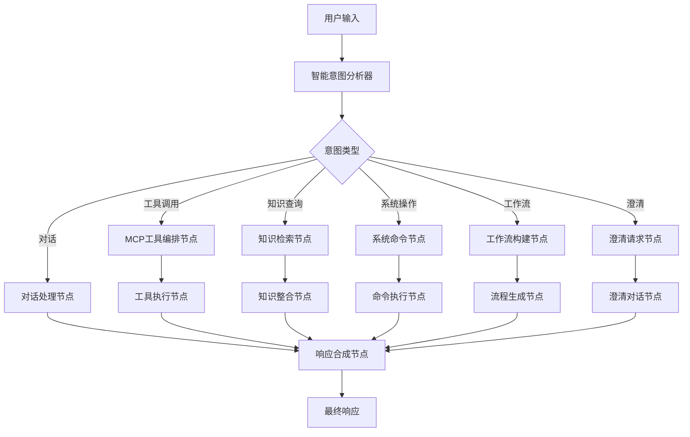

# LLM流程优化设计文档

## 概述

基于PocketFlow的轻量级工作流编排理念，重新设计Bor智能体中枢的LLM处理流程。将现有的线性处理模式升级为图形化流程编排，提升意图分析准确性和MCP工具调用效率。

## 架构设计

### 核心组件



### 1. 智能意图分析器 (Enhanced Intent Analyzer)

**设计原则**: 参考PocketFlow的轻量级理念，使用规则引擎+机器学习的混合方法

**核心功能**:
- 多层意图识别（粗粒度 → 细粒度）
- 上下文感知的意图推理
- 置信度评估和不确定性处理
- 实体提取和参数推断

**实现架构**:
```typescript
interface IntentAnalysisResult {
  primaryIntent: IntentType
  confidence: number
  entities: ExtractedEntity[]
  parameters: Record<string, any>
  alternativeIntents: IntentCandidate[]
  contextFactors: ContextFactor[]
}

class EnhancedIntentAnalyzer {
  private ruleEngine: RuleEngine
  private contextManager: ContextManager
  private entityExtractor: EntityExtractor
  
  async analyze(input: string, context: ConversationContext): Promise<IntentAnalysisResult>
  private extractEntities(input: string): ExtractedEntity[]
  private calculateConfidence(matches: RuleMatch[], context: ConversationContext): number
  private resolveAmbiguity(candidates: IntentCandidate[]): IntentType
}
```

### 2. 流程编排引擎 (Flow Orchestration Engine)

**设计原则**: 借鉴PocketFlow的节点化设计，支持动态流程构建

**核心特性**:
- 声明式流程定义
- 动态节点路由
- 并行执行支持
- 错误恢复机制

**流程节点类型**:
```typescript
abstract class FlowNode {
  abstract id: string
  abstract type: string
  abstract execute(input: FlowInput): Promise<FlowOutput>
  
  protected successors: string[] = []
  protected errorHandlers: ErrorHandler[] = []
}

// 具体节点实现
class IntentAnalysisNode extends FlowNode
class MCPToolSelectionNode extends FlowNode
class ToolExecutionNode extends FlowNode
class ResponseSynthesisNode extends FlowNode
class ContextUpdateNode extends FlowNode
```

### 3. MCP工具智能调度器 (Smart MCP Dispatcher)

**设计目标**: 将MCP工具调用从简单的匹配升级为智能编排

**核心能力**:
- 工具能力映射和匹配
- 并行执行优化
- 负载均衡和故障转移
- 结果聚合和后处理

**架构设计**:
```typescript
class SmartMCPDispatcher {
  private toolRegistry: MCPToolRegistry
  private executionPlanner: ExecutionPlanner
  private resultAggregator: ResultAggregator
  
  async dispatch(intent: ToolCallIntent): Promise<ToolExecutionResult> {
    const plan = await this.executionPlanner.createPlan(intent)
    const results = await this.executeParallel(plan)
    return this.resultAggregator.aggregate(results)
  }
  
  private async executeParallel(plan: ExecutionPlan): Promise<ToolResult[]>
  private selectOptimalTools(requirements: ToolRequirement[]): MCPTool[]
}
```

## 数据模型

### 对话上下文模型
```typescript
interface ConversationContext {
  sessionId: string
  userId: string
  messageHistory: Message[]
  userProfile: UserProfile
  systemState: SystemState
  activeWorkflows: WorkflowInstance[]
  contextWindow: ContextWindow
}

interface ContextWindow {
  recentMessages: Message[]
  extractedEntities: Entity[]
  activeTopics: Topic[]
  userIntentions: IntentHistory[]
}
```

### 流程执行模型
```typescript
interface FlowExecution {
  flowId: string
  startTime: number
  currentNode: string
  executionPath: ExecutionStep[]
  context: FlowContext
  status: 'running' | 'completed' | 'failed' | 'paused'
}

interface ExecutionStep {
  nodeId: string
  startTime: number
  endTime?: number
  input: any
  output?: any
  error?: Error
  metadata: Record<string, any>
}
```

## 错误处理策略

### 多层回退机制
1. **节点级回退**: 单个节点失败时的本地恢复
2. **流程级回退**: 整个流程失败时的替代路径
3. **系统级回退**: 回退到传统LLM处理模式

### 错误分类和处理
```typescript
enum ErrorType {
  INTENT_ANALYSIS_FAILED = 'intent_analysis_failed',
  TOOL_EXECUTION_FAILED = 'tool_execution_failed',
  CONTEXT_INSUFFICIENT = 'context_insufficient',
  RESOURCE_UNAVAILABLE = 'resource_unavailable',
  TIMEOUT = 'timeout'
}

interface ErrorHandler {
  canHandle(error: FlowError): boolean
  handle(error: FlowError, context: FlowContext): Promise<RecoveryAction>
}
```

## 性能优化

### 缓存策略
- **意图分析缓存**: 相似输入的意图结果缓存
- **工具结果缓存**: 幂等工具调用的结果缓存
- **上下文缓存**: 会话上下文的智能缓存

### 并行执行优化
- **工具并行调用**: 独立工具的并行执行
- **流水线处理**: 流程节点的流水线执行
- **预测性加载**: 基于意图预测的资源预加载

## 测试策略

### 单元测试
- 意图分析器的准确性测试
- 各流程节点的功能测试
- 错误处理机制的鲁棒性测试

### 集成测试
- 端到端流程执行测试
- MCP工具集成测试
- 性能基准测试

### 用户体验测试
- 响应时间测试
- 意图识别准确率测试
- 错误恢复用户体验测试

## 实施计划

### 阶段1: 核心框架搭建
- 实现基础的流程编排引擎
- 创建核心流程节点
- 建立错误处理机制

### 阶段2: 意图分析增强
- 升级意图识别算法
- 实现上下文感知机制
- 添加实体提取功能

### 阶段3: MCP工具优化
- 实现智能工具调度
- 添加并行执行支持
- 优化结果聚合逻辑

### 阶段4: 性能优化和测试
- 实施缓存策略
- 进行性能调优
- 完善测试覆盖

这个设计将现有的线性LLM处理升级为智能化的流程编排系统，显著提升用户交互体验和系统响应能力。